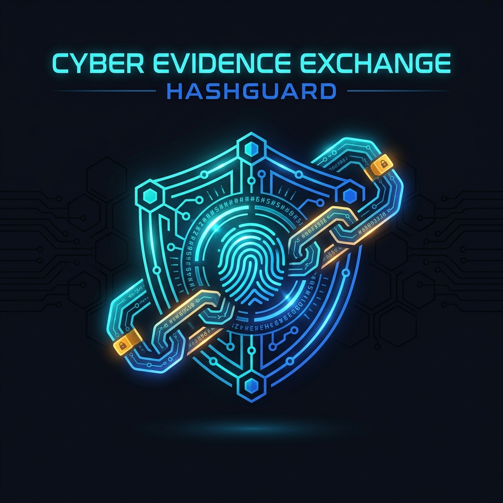
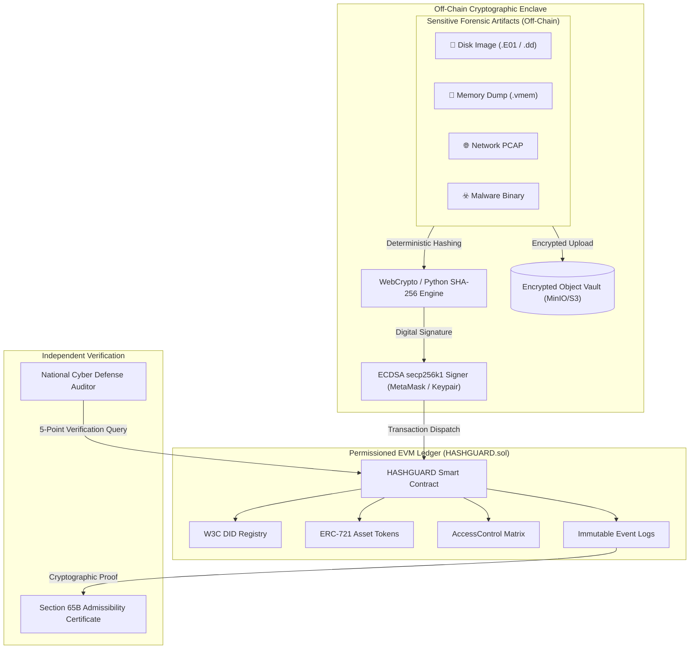
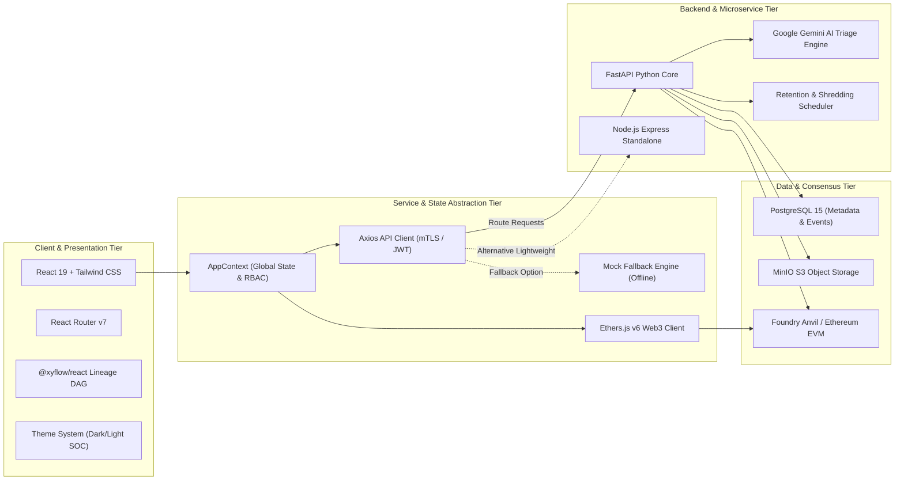
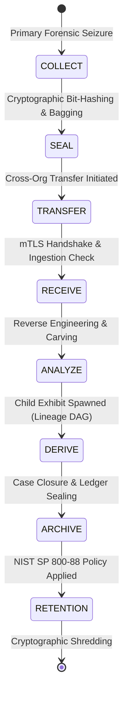
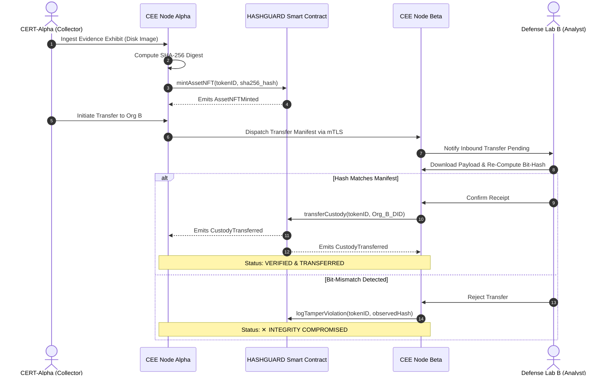

<div align="center">
  

  # 🛡️ HASHGUARD : Cyber Evidence Exchange (CEE)
  ### Immutable Digital Forensic Custody, Decentralized Identity (DID) & Zero-Trust Lineage Ledger

  [](https://opensource.org/licenses/MIT)
  [](https://react.dev/)
  [](https://vitejs.dev/)
  [](https://tailwindcss.com/)
  [](https://soliditylang.org/)
  [](https://fastapi.tiangolo.com/)
  [](https://www.python.org/)
  [](https://www.postgresql.org/)
  [](https://min.io/)
  [](https://docs.ethers.org/v6/)
  [](https://www.w3.org/TR/did-core/)
  [](https://www.iso.org/standard/44381.html)

  <br />

  **A military-grade, cross-organization cyber forensic evidence exchange platform engineered to guarantee bit-level non-repudiation, tamper-evident chain of custody, and cryptographic lineage tracking across incident response teams, law enforcement, defense laboratories, and judicial bodies.**

  <br />

  [Explore Live Features](#-platform-showcase--route-directory) •
  [Architecture & Design](#-system-architecture--data-segregation) •
  [Quickstart Guide](#-quickstart--deployment-guide) •
  [Smart Contracts](#-smart-contract-deep-dive) •
  [API Contract](#-backend-api-reference) •
  [Compliance & Admissibility](#-legal-regulatory--standards-admissibility)

</div>

---

## 📌 Table of Contents

- [Executive Summary](#-executive-summary)
- [Key Features & Innovations](#-key-features--innovations)
- [System Architecture & Data Segregation](#-system-architecture--data-segregation)
  - [Off-Chain vs. On-Chain Segregation Model](#off-chain-vs-on-chain-segregation-model)
  - [System Flow & Layered Architecture](#system-flow--layered-architecture)
  - [Custody State Machine Lifecycle](#custody-state-machine-lifecycle)
  - [Cross-Organization Transfer Protocol](#cross-organization-transfer-protocol)
- [Platform Showcase & Route Directory](#-platform-showcase--route-directory)
- [Technology Stack](#-technology-stack)
- [Smart Contract Deep Dive (`HASHGUARD.sol`)](#-smart-contract-deep-dive)
  - [Decentralized Identifiers (W3C DID v1.0)](#1-decentralized-identifiers-w3c-did-v10)
  - [NFT-Based Asset Ownership (ERC-721)](#2-nft-based-asset-ownership-erc-721)
  - [On-Chain Role-Based Access Control (RBAC)](#3-on-chain-role-based-access-control-rbac)
  - [On-Chain Audit Events](#4-on-chain-audit-events)
- [Backend API Reference](#-backend-api-reference)
- [Quickstart & Deployment Guide](#-quickstart--deployment-guide)
  - [Prerequisites](#prerequisites)
  - [Method 1: Instant Evaluation (Frontend + Zero-Config Offline Sandbox)](#method-1-instant-evaluation-frontend--zero-config-offline-sandbox)
  - [Method 2: Standalone Node.js Microservice Backend](#method-2-standalone-nodejs-microservice-backend)
  - [Method 3: Production Docker Compose Enterprise Stack](#method-3-production-docker-compose-enterprise-stack)
- [Interactive Tamper Simulation & Verification](#-interactive-tamper-simulation--verification)
- [AI Threat Triage Integration](#-ai-threat-triage-integration)
- [Legal, Regulatory & Standards Admissibility](#-legal-regulatory--standards-admissibility)
- [Project Directory Structure](#-project-directory-structure)
- [Contributing & Security Policy](#-contributing--security-policy)
- [License](#-license)

---

## 📖 Executive Summary

During cyber incident investigations, digital evidence (disk images, memory dumps, network PCAPs, malware binaries, mobile extractions) frequently transitions across multiple organizational boundaries—from corporate Security Operations Centers (SOCs) to Computer Emergency Response Teams (CERTs), external forensic consultants, intelligence agencies, and courtroom tribunals.

### The Problem
Conventional evidence management relies on centralized databases (Active Directory, LDAP, cloud storage buckets, or paper forms). These legacy practices introduce critical systemic risks:
- **Single Points of Failure (SPOF)**: Centralized root admins can tamper with evidence files or delete audit logs without detection.
- **Inter-Agency Trust Deficits**: Receiving agencies cannot mathematically verify whether seized media underwent alteration during transit.
- **Broken Lineage**: Derived evidence (decompilations, carved files, extracted memory payloads, IOCs) loses its mathematical link to the original physical seizure.
- **Inadmissibility in Court**: Failure to meet stringent electronic evidence admissibility statutes (e.g., Section 65B of the Indian Evidence Act, NIST SP 800-88, ISO/IEC 27037, and Federal Rules of Evidence Rule 902(13)/(14)).

### The HASHGUARD Solution
**HASHGUARD** provides an authoritative, cryptographically verified solution that marries **Self-Sovereign Identity (W3C DIDs)**, **ERC-721 Non-Fungible Tokens**, **EVM Smart Contract RBAC**, and **Off-Chain Cryptographic Enclaves**. Every custody transfer, bitstream hash, and forensic transformation is anchored in an immutable ledger—delivering an unbreakable chain of custody and instant zero-knowledge audit verification.

---

## ⚡ Key Features & Innovations

- **🔐 Privacy-Preserving Off-Chain Enclave Architecture**: Sensitive gigabyte-scale disk images, malware binaries, and memory dumps remain securely in encrypted off-chain object storage (MinIO / S3). Only deterministic SHA-256 digests, ECDSA signatures, and state proofs are anchored on-chain.
- **🆔 Self-Sovereign Decentralized Identifiers (W3C DID v1.0)**: Eliminates centralized IAM dependencies. Custodians, analysts, and auditors are bound to cryptographic DIDs (`did:ethr:<address>`) with on-chain DID Document hash anchoring.
- **🪙 NFT-Backed Evidence Ownership (ERC-721)**: Unique forensic exhibits are minted as on-chain non-fungible tokens, providing non-duplicable, transparent ownership and strictly serialized transfer receipts.
- **🛡️ Bytecode-Enforced RBAC**: Granular roles (`ROLE_ADMIN`, `ROLE_MANAGER`, `ROLE_AUDITOR`, `ROLE_USER`) are strictly enforced at the EVM smart contract execution level with zero-trust privilege boundaries.
- **🌐 Interactive Forensic Lineage DAG**: Powered by `@xyflow/react`, this interactive directed acyclic graph visualizes the entire life cycle of derived evidence—from primary seized payloads to decompilations, carved files, YARA/Sigma rules, and courtroom executive summaries.
- **🔍 5-Point Zero-Trust Auditor Suite**: Independent zero-knowledge verification engine that validates bit-level **Hash Integrity**, **ECDSA Signatures**, **Custody Continuity**, **Sequential Monotonicity**, and **DAG Lineage** without leaking file contents. Generates exportable, court-ready JSON/PDF audit certificates.
- **🚨 Real-Time Bit-Level Tamper Simulator**: Interactive top-bar toggle that simulates a bit-level specimen modification in real time. Instantly flips system-wide statuses to `✕ INTEGRITY COMPROMISED` and exposes the failure cascade in the auditor portal.
- **🤖 Gen-AI Forensic Threat Triage**: Embedded neural triage powered by Google Gemini (`gemini-1.5-flash` / `gemini-pro`) to analyze Shannon entropy, identify binary packing, extract MITRE ATT&CK indicators, and parse IOCs from investigator notes.
- **⏳ NIST SP 800-88 Compliant Retention & Shredding**: Automated life cycle retention schedules, administrative legal hold lockdowns, and verifiable cryptographic media eradication logging.
- **🌗 Persistent SOC High-Contrast Theme System**: Sleek forensic dark mode and high-contrast light mode with real-time UI switching and persistent local preferences.
- **🎯 1-Click Sandbox Evaluation Route (`/sandbox`)**: Instant automated authentication as Lead Forensic Investigator with realistic forensic datasets for seamless review and evaluation without manual setup.

---

## 🏗️ System Architecture & Data Segregation

### Off-Chain vs. On-Chain Segregation Model

Digital forensic artifacts typically range from hundreds of megabytes to multiple terabytes in size. Ingesting raw payloads into a blockchain would be computationally prohibitive, cost-inefficient, and would violate data privacy regulations. HASHGUARD implements an air-tight segregation model:

| Layer | Component | Contents & Operations | Cryptographic Guarantee |
|---|---|---|---|
| **Off-Chain Storage Vault** | MinIO / S3 / Encrypted Enclave | Disk images (`.E01`, `.dd`), PCAP captures, memory dumps (`.vmem`), malware binaries, decompiled artifacts | AES-256-GCM rest encryption, strict presigned URL access, local hardware storage |
| **Off-Chain Crypto Engine** | WebCrypto / Python Cryptography | Client-side chunked SHA-256 bit digest hashing, secp256k1 ECDSA digital signatures | Deterministic zero-leakage payload fingerprinting |
| **On-Chain Audit Ledger** | EVM Smart Contract (`HASHGUARD.sol`) | SHA-256 Bit Hashes, W3C DIDs, ERC-721 Token IDs, Custody State Machine Transitions, RBAC Assignments | Immutability, non-repudiation, tamper-evident event emission, consensus timestamping |



---

### System Flow & Layered Architecture



---

### Custody State Machine Lifecycle

Every forensic exhibit follows a strict, non-reversible deterministic state machine. State mutations trigger indexed blockchain events:



---

### Cross-Organization Transfer Protocol



---

## 🧭 Platform Showcase & Route Directory

The platform provides a responsive, single-page application built on React 19, modularized with role guards, modal drawers, and export pipelines:

| Route | Page | Purpose & Capabilities | Allowed Roles |
|---|---|---|---|
| `/landing` | **Platform Landing & Showcase** | High-impact overview of platform architecture, security guarantees, standards compliance, and live demo launch pad. | Public |
| `/login` | **Unified Authentication & DID Portal** | Multi-persona authentication portal supporting traditional credentials or Web3 DID wallet identity binding. | Public |
| `/sandbox` | **1-Click Reviewer Sandbox** | Automatically provisions a Lead Forensic Investigator session, seeds realistic forensic datasets, and opens the SOC Dashboard. | Public / Evaluators |
| `/dashboard` | **Forensic SOC Operations Dashboard** | High-level situational awareness: KPI counters (Total Evidence, Intact Seals, Active Transfers, Tamper Alerts), active custody pipeline, and quick actions. | Admin, Manager, Auditor, Custodian |
| `/evidence` | **Evidence Repository** | Multi-attribute filtering (Status, Organization, Exhibit Type), instant SHA-256 hash copy, and drag-and-drop evidence registration modal. | Admin, Manager, Custodian |
| `/evidence/:id` | **Forensic Dossier Details** | Deep specimen inspection: side-by-side SHA-256 hash comparison, HSM ECDSA signature breakdown, off-chain isolation badge, vertical custody event logs, and Gemini AI Threat Triage. | Admin, Manager, Auditor, Custodian |
| `/transfers` | **Cross-Agency Transfer Pipeline** | Active transfer queue, interactive mTLS handshake pipeline visualizer, initiate transfer modal, and verify-on-receipt cryptographic attestation. | Admin, Manager, Custodian |
| `/custody` | **Global Custody Explorer** | Searchable, chronological audit explorer detailing all custody transitions, actor emails, digital signatures, and transaction roots. | Admin, Manager, Auditor, Custodian |
| `/lineage` | **Evidence Lineage DAG** | Interactive node-based provenance graph (`@xyflow/react`) mapping parent-to-child relationships (e.g., Raw Payload → Decompiled Source → YARA Rules → Final Report). | Admin, Manager, Auditor, Custodian |
| `/verification` | **Zero-Trust Auditor Suite** | Independent forensic verification interface executing a 5-point verification checklist (`HASH`, `SIGNATURE`, `CUSTODY`, `SEQUENCE`, `LINEAGE`) and generating exportable court certificates. | Admin, Auditor |
| `/audit` | **Immutable Audit Logs Ledger** | Tabular raw on-chain transaction stream with block height references, sender DIDs, activity types, and CSV export. | Admin, Auditor |
| `/retention` | **Lifecycle Retention & Shredding** | ISO/NIST compliant retention policy manager, legal hold freeze controls, and NIST SP 800-88 cryptographic shredding logs. | Admin, Manager |
| `/settings` | **System & Network Configuration** | Switch active organization context, inspect blockchain node RPC connectivity, configure RBAC roles, and toggle dark/light theme mode. | Admin, Manager, Auditor, Custodian |

---

## 💻 Technology Stack

| Layer | Component | Technologies & Libraries | Version | Role in Architecture |
|---|---|---|---|---|
| **Frontend Core** | Web Application | React, Vite | React 19.2, Vite 8.2 | High-performance reactive UI rendering |
| **Styling & Theme** | User Interface | Tailwind CSS, PostCSS, Lucide Icons | Tailwind 3.4 | Forensic SOC design system, dark/light theme switcher |
| **Visualizations** | Graphs & Analytics | `@xyflow/react`, Recharts | xyflow 12.11, Recharts 3.10 | Interactive Lineage DAG, activity velocity charts |
| **Web3 Client** | Blockchain Interface | Ethers.js | v6.17 | EVM transaction signing, contract ABI invocation, DID lookup |
| **API Client** | HTTP Networking | Axios | v1.19 | REST API communication with automated mock fallback engine |
| **Smart Contract** | EVM Consensus | Solidity, OpenZeppelin Contracts | Solidity ^0.8.20, OZ 5.6 | ERC-721 tokenization, AccessControl RBAC, DID registry |
| **Backend Core** | RESTful Services | FastAPI, Uvicorn, Python | FastAPI 0.110, Python 3.11+ | High-throughput asynchronous backend service APIs |
| **AI Triage** | Threat Intelligence | Google Generative AI (Gemini) | `google-generativeai 0.8.6` | Automated binary entropy & IoC extraction |
| **Relational Database** | Relational Ledger | PostgreSQL, SQLAlchemy | Postgres 15, SQLAlchemy 2.0 | Metadata indexing, user sessions, event caching |
| **Object Storage** | Off-Chain Enclave | MinIO (S3 Compatible) | S3 API v4 | Encrypted storage for disk images, binaries, PCAPs |
| **Blockchain Node** | Local EVM DevNet | Foundry Anvil | Latest | High-speed local EVM node with unlocked accounts |
| **Micro Backend** | Standalone Testing | Node.js Express | Express 4, Node 18+ | Zero-dependency standalone JSON-backed REST API |
| **Containers** | Infrastructure | Docker, Docker Compose | Compose v3.8 | Turnkey multi-container orchestration |

---

## 📜 Smart Contract Deep Dive

The contract [`contracts/HASHGUARD.sol`](contracts/HASHGUARD.sol) is written in Solidity `^0.8.20` and extends OpenZeppelin's `ERC721` and `AccessControl`.

### 1. Decentralized Identifiers (W3C DID v1.0)
```solidity
struct UserIdentity {
    string didURI;           // e.g. "did:ethr:0x4B20993Bc481177ec7E8f571ceCaE8A9e22C02db"
    bytes32 didDocumentHash; // keccak256 hash of published DID Document
    uint256 registeredAt;
    bool exists;
}
mapping(address => UserIdentity) public didRegistry;

function registerDID(address user, string memory didURI, bytes32 didDocumentHash) external onlyRole(ROLE_ADMIN);
function verifyDID(address user) external view returns (bool, string memory, bytes32);
```

### 2. NFT-Based Asset Ownership (ERC-721)
```solidity
struct EvidenceMetadata {
    string assetId;          // e.g. "EV-2026-0891"
    bytes32 contentHash;     // Deterministic SHA-256 bitstream digest
    bytes32 metadataHash;    // Integrity hash of acquisition parameters
}
mapping(uint256 => EvidenceMetadata) public evidenceAssets;
mapping(string => uint256) public assetIdToTokenId; // Reverse lookup

function mintAssetNFT(address to, string memory assetId, bytes32 contentHash, bytes32 metadataHash) external returns (uint256);
function transferCustody(uint256 tokenId, address to) external;
```

### 3. On-Chain Role-Based Access Control (RBAC)
```solidity
bytes32 public constant ROLE_ADMIN   = DEFAULT_ADMIN_ROLE;
bytes32 public constant ROLE_MANAGER = keccak256("ROLE_MANAGER");
bytes32 public constant ROLE_AUDITOR = keccak256("ROLE_AUDITOR");
bytes32 public constant ROLE_USER    = keccak256("ROLE_USER");
```
- **ROLE_ADMIN**: Can grant/revoke roles, register new DIDs, update smart contract parameters, and execute cryptographic shredding.
- **ROLE_MANAGER**: Can mint new asset NFTs, authorize inter-organization transfers, and configure legal holds.
- **ROLE_AUDITOR**: Can query all ledger states, emit independent audit attestation events (`AuditorVerified`), and inspect historical logs.
- **ROLE_USER / CUSTODIAN**: Can initiate transfers for assigned tokens and register evidence exhibits.

### 4. On-Chain Audit Events
Every critical operation emits an immutable, indexed event:
- `IdentityRegistered(address indexed user, bytes32 didDocumentHash)`
- `AssetNFTMinted(uint256 indexed tokenId, string assetId, address indexed to, bytes32 contentHash, uint256 timestamp)`
- `CustodyTransferred(uint256 indexed tokenId, address indexed from, address indexed to)`
- `HashVerified(uint256 indexed tokenId, bytes32 expectedHash, bytes32 observedHash, bool valid)`
- `AuditorVerified(address indexed auditor, bytes32 credentialHash, bool valid)`
- `RetentionEvent(uint256 indexed tokenId, string eventType, address actor, uint256 timestamp)`

---

## 🔌 Backend API Reference

The backend exposes a standardized RESTful API compliant with OpenAPI 3.0 at `/api/v1`:

| Domain | Method | Endpoint | Description |
|---|---|---|---|
| **Authentication** | `POST` | `/api/v1/auth/login` | Authenticate user credentials or DID wallet signature, returning a JWT session token. |
| | `GET` | `/api/v1/auth/me` | Fetch active user identity, organization profile, and RBAC permissions. |
| **Evidence Management** | `GET` | `/api/v1/evidence` | Query evidence exhibits with optional filtering (`search`, `status`, `type`, `organization`). |
| | `GET` | `/api/v1/evidence/{id}` | Retrieve comprehensive dossier for a single exhibit including bit-hash and custodian history. |
| | `POST` | `/api/v1/evidence` | Ingest new evidence artifact, calculate SHA-256 digest, and trigger on-chain minting. |
| **Custody Events** | `GET` | `/api/v1/custody/events` | List all historical custody transition events across the ledger. |
| | `GET` | `/api/v1/custody/events/{id}` | Fetch granular custody timeline for a specific exhibit ID. |
| | `POST` | `/api/v1/custody/events` | Record a new custody state transition (`SEAL`, `ANALYZE`, `TRANSFER`, etc.). |
| **Transfers** | `GET` | `/api/v1/transfers` | List cross-organization transfer manifests and current handshake statuses. |
| | `POST` | `/api/v1/transfers` | Initiate a new cross-agency evidence transfer with cryptographic manifest. |
| | `POST` | `/api/v1/transfers/{id}/accept` | Accept and verify inbound evidence transfer after bit-level hash comparison. |
| **Lineage DAG** | `GET` | `/api/v1/lineage/{id}` | Retrieve complete parent-child derivation tree for graphical DAG visualization. |
| | `POST` | `/api/v1/lineage/derive` | Register a derived child evidence item linked to parent specimen. |
| **Verification** | `POST` | `/api/v1/verification/verify` | Execute the 5-point zero-trust audit verification algorithm on an evidence ID. |
| **Audit Logs** | `GET` | `/api/v1/audit/logs` | Fetch raw on-chain transaction logs with block heights and signatures. |
| **AI Threat Triage** | `POST` | `/api/v1/ai/triage` | Trigger Google Gemini neural triage on raw forensic notes and extract IoCs. |
| **Retention & Legal** | `GET` | `/api/v1/admin/retention/policies` | Retrieve active NIST SP 800-88 retention rules and legal hold registers. |
| | `POST` | `/api/v1/admin/retention/shred` | Execute cryptographic media eradication and anchor shredding proof on-chain. |

---

## 🚀 Quickstart & Deployment Guide

### Prerequisites
- **Node.js**: v18.0.0 or higher
- **npm**: v9.0.0 or higher
- *(Optional for Full Stack)*: **Python 3.11+**, **Docker & Docker Compose**, **Foundry Anvil**

---

### Method 1: Instant Evaluation (Frontend + Zero-Config Offline Sandbox)
HASHGUARD includes a built-in mock fallback engine (`VITE_ENABLE_MOCK_FALLBACK=true`). You can run the entire platform immediately with zero external database or blockchain dependencies!

```bash
# 1. Clone repository
git clone https://github.com/pds-37/Hash-Guard.git
cd Hash-Guard

# 2. Install dependencies
npm install

# 3. Launch Vite development server
npm run dev
```

The application is now live at **`http://localhost:5173`**.

> **💡 Instant Reviewer Sandbox**: Navigate to **`http://localhost:5173/sandbox`** or click **"Launch Interactive Sandbox"** on the landing page to bypass login, seed realistic cyber forensic datasets, and evaluate the full SOC environment immediately!

---

### Method 2: Standalone Node.js Microservice Backend
For environments where Python/Docker is unavailable, a lightweight Node.js Express backend is included:

```bash
# From repository root:
cd node_backend

# Install dependencies and start server
npm install
node server.js
```
The Node.js API runs at `http://localhost:8001` and serves mock-persisted JSON data matching all frontend endpoints.

---

### Method 3: Production Docker Compose Enterprise Stack
To spin up the entire enterprise infrastructure (FastAPI, PostgreSQL 15, MinIO S3, and Anvil EVM Blockchain):

```bash
# 1. Launch all services via Docker Compose
docker-compose up -d --build

# 2. Verify container health
docker-compose ps
```

**Services launched:**
- **FastAPI API**: `http://localhost:8001` (API docs at `/api/v1/docs`)
- **PostgreSQL Database**: `localhost:5433` (Database: `cee`)
- **MinIO Object Store**: `http://localhost:9000` (Console at `http://localhost:9001`, user/pass: `minioadmin` / `minioadmin`)
- **Foundry Anvil EVM**: `http://localhost:8545`

```bash
# 3. Start the Frontend connected to the live API
# In .env: set VITE_API_BASE_URL=http://localhost:8001/api/v1 and VITE_ENABLE_MOCK_FALLBACK=false
npm run dev
```

---

## 🚨 Interactive Tamper Simulation & Verification

One of HASHGUARD's flagship features is its **Live Tamper Demonstration Mode**, designed to demonstrate zero-trust resilience in courtroom simulations and security audits.

```
+-----------------------------------------------------------------------------------+
|  [ TOPBAR ]   ⚡ SIMULATE BIT TAMPER  [OFF / ON]   |  ORGB: Cyber Defense Lab B  |
+-----------------------------------------------------------------------------------+
```

### How to Test Tamper Detection:
1. Navigate to the **Evidence Repository** (`/evidence`) and select exhibit **`EV-2026-0891` (Cobalt Strike Beacon Memory Dump)**.
2. Observe the pristine status:
   - Status Badge: `VERIFIED IN VAULT`
   - Content Hash: `e3b0c44298fc1c149afbf4c8996fb92427ae41e4649b934ca495991b7852b855`
   - All 5 checklist points in Independent Verification (`/verification`): `PASSED`
3. Click the red **"SIMULATE BIT TAMPER"** toggle in the top-right header.
4. **Instant Ripple Effect Across Platform**:
   - The exhibit status turns to **`✕ INTEGRITY COMPROMISED`**.
   - A prominent warning banner appears across the SOC Dashboard and Evidence Dossier.
   - The Independent Verification Suite immediately displays:
     - ❌ **Bitstream Hash Integrity**: `FAILED` (Expected vs. Observed mismatch).
     - ❌ **Cryptographic Sequence**: `INTEGRITY_VIOLATION`.
     - Certification Button: Disabled with security violation notice.
5. Toggle **"RESTORE INTACT"** to return the ledger to an authentic state.

---

## 🤖 AI Threat Triage Integration

HASHGUARD incorporates an AI-driven forensic threat triage module powered by Google Gemini:

1. Open any evidence dossier (e.g. `/evidence/EV-2026-0891`).
2. Scroll to the **AI Threat Triage** section and click **"Run AI Auto-Triage"**.
3. The engine parses the raw forensic sample, decompiled strings, and acquisition notes to deliver:
   - **Calculated Threat Level**: `CRITICAL` / `HIGH` / `MEDIUM` / `LOW`.
   - **Shannon Entropy Analysis**: Detects packed or encrypted payload sections.
   - **MITRE ATT&CK Mapping**: Identifies evasion tactics (e.g. T1070 Indicator Removal).
   - **Extracted IoCs**: Automatically extracts IPs, C2 domains, and suspicious command invocations.
   - **Investigator Action Recommendation**: Next steps for containment and reverse engineering.

---

## ⚖️ Legal, Regulatory & Standards Admissibility

HASHGUARD is engineered specifically to satisfy global digital evidence admissibility mandates:

| Standard / Regulation | Legal / Technical Requirement | How HASHGUARD Complies |
|---|---|---|
| **Section 65B, Indian Evidence Act** | Certification of electronic records showing unbroken device custody and uncorrupted reproduction. | Automated generation of on-chain signed audit certificates with timestamped block heights and custodian identities. |
| **ISO/IEC 27037:2012** | Guidelines for identification, collection, acquisition, and preservation of digital evidence. | Deterministic custody state machine (`COLLECT` → `SEAL` → `TRANSFER` → `RECEIVE`) preventing out-of-order state transitions. |
| **NIST SP 800-88 Rev. 1** | Media sanitization and verifiable cryptographic eradication. | Automated retention scheduler with administrative legal hold freezes and verifiable cryptographic shredding logging. |
| **Federal Rules of Evidence (FRE) Rule 902(13) & (14)** | Certified records generated by an electronic process or data copied from an electronic device. | Deterministic SHA-256 bit digests paired with secp256k1 digital signatures and public smart contract verification. |
| **W3C Decentralized Identifiers (DID) v1.0** | Cryptographically verifiable identifiers independent of centralized authorities. | DIDs formatted as `did:ethr:<address>` registered directly on-chain with immutable DID Document anchoring. |

---

## 📁 Project Directory Structure

```plaintext
Cyber-Evidence-Exchange/
├── contracts/                        # Smart Contracts Tier
│   └── HASHGUARD.sol                 # Primary ERC-721 + AccessControl + DID Contract
├── backend/                          # FastAPI Production Backend Tier
│   ├── app/
│   │   ├── api/routes/               # REST API Endpoints (auth, evidence, custody, transfers, ai...)
│   │   ├── blockchain/               # Web3.py client & EVM integration
│   │   ├── core/                     # Configuration, security, exceptions, scheduler
│   │   ├── crypto/                   # Bit-level hashing & ECDSA signature verification
│   │   ├── database/                 # SQLAlchemy engine, session & init_db
│   │   ├── models/                   # PostgreSQL ORM models
│   │   ├── schemas/                  # Pydantic validation schemas
│   │   ├── services/                 # Business logic services
│   │   ├── storage/                  # MinIO S3 object storage driver
│   │   └── main.py                   # FastAPI application entrypoint
│   ├── Dockerfile                    # Backend container specification
│   ├── requirements.txt              # Python dependency manifest
│   └── seed_audit_logs.py            # Initial audit event seeder
├── node_backend/                     # Lightweight Standalone Node.js Backend
│   ├── server.js                     # Express REST API server (Port 8001)
│   ├── db.json                       # Mock JSON persistence database
│   └── package.json                  # Node backend dependencies
├── src/                              # Frontend React 19 Application Tier
│   ├── assets/                       # Static media, icons & graphics
│   ├── components/                   # Modular UI components
│   │   ├── audit/                    # Audit ledger tables & export buttons
│   │   ├── common/                   # Reusable badges, cards, modals, theme toggles
│   │   ├── custody/                  # Custody timeline & event inspectors
│   │   ├── dashboard/                # SOC KPI cards, tamper banner, velocity charts
│   │   ├── evidence/                 # Evidence tables, AI Threat Triage, upload modals
│   │   ├── layout/                   # AppShell, Header, Sidebar, BootSequence
│   │   ├── lineage/                  # React Flow DAG custom nodes & derivation modal
│   │   ├── transfer/                 # Transfer queues, mTLS handshake pipeline visualizer
│   │   └── verification/             # 5-point verification checklist & certificate generator
│   ├── context/                      # React Context providers (AppContext, ThemeContext)
│   ├── contracts/                    # Deployed contract ABI definitions
│   ├── mock/                         # Rich offline mock datasets for zero-dependency demo
│   ├── pages/                        # View controllers (Dashboard, Evidence, Lineage, Settings...)
│   ├── services/                     # Network clients (apiClient.js, blockchainClient.js)
│   ├── utils/                        # Forensic hashing, formatting & crypto helpers
│   ├── App.jsx                       # Route definitions & sandbox router
│   ├── index.css                     # Tailwind CSS directives & SOC styling
│   └── main.jsx                      # React DOM mount point
├── docs/                             # Technical Documentation
│   └── API_CONTRACT.md               # Frontend-Backend REST API Contract Specification
├── public/                           # Static assets served at root
│   └── cyber_evidence_logo.jpg       # High-resolution platform logo
├── docker-compose.yml                # Enterprise multi-container orchestration
├── package.json                      # Frontend dependencies & npm scripts
├── tailwind.config.js                # Custom SOC color palette & typography
├── vite.config.js                    # Vite bundler configuration
└── README.md                         # Comprehensive System Documentation
```

---

## 👥 Personas & Role-Based Access Control

The platform models realistic inter-agency cybersecurity operations:

| Persona | Organization | Key Capabilities & Responsibility |
|---|---|---|
| **Originator / Collector** | **CERT-Alpha (Computer Emergency Response Team)** | Primary evidence seizure, physical bagging, SHA-256 content hashing, initial minting, and outbound transfers. |
| **Forensic Analyst** | **Cyber Defense & Forensics Lab B** | Inbound transfer acceptance, bit-level integrity verification, reverse engineering, child evidence derivation (Lineage DAG). |
| **Independent Auditor** | **National Cyber Security Audit Board** | Read-only ledger inspection, 5-point zero-trust verification execution, courtroom certificate issuance. |
| **Super Administrator** | **Platform Security Officer** | DID lifecycle management, smart contract role delegation, retention policy enforcement, and NIST SP 800-88 cryptographic shredding. |

---

## 🤝 Contributing & Security Policy

### Contributing
Contributions to HASHGUARD are welcome! To contribute:
1. Fork the repository.
2. Create your feature branch (`git checkout -b feature/advanced-pcap-parser`).
3. Commit your changes (`git commit -m 'feat: add automated pcap flow extraction'`).
4. Push to the branch (`git push origin feature/advanced-pcap-parser`).
5. Open a Pull Request.

### Vulnerability Disclosure
For security issues or cryptographic concerns, please submit a responsible disclosure report directly to the repository maintainers.

---

## 📄 License

This project is licensed under the **MIT License** — see the [LICENSE](LICENSE) file for details.

---

<div align="center">
  <sub>Engineered with precision for high-assurance cyber forensic integrity and cross-border evidence custody.</sub><br />
  <b>HASHGUARD • Cyber Evidence Exchange</b>
</div>
