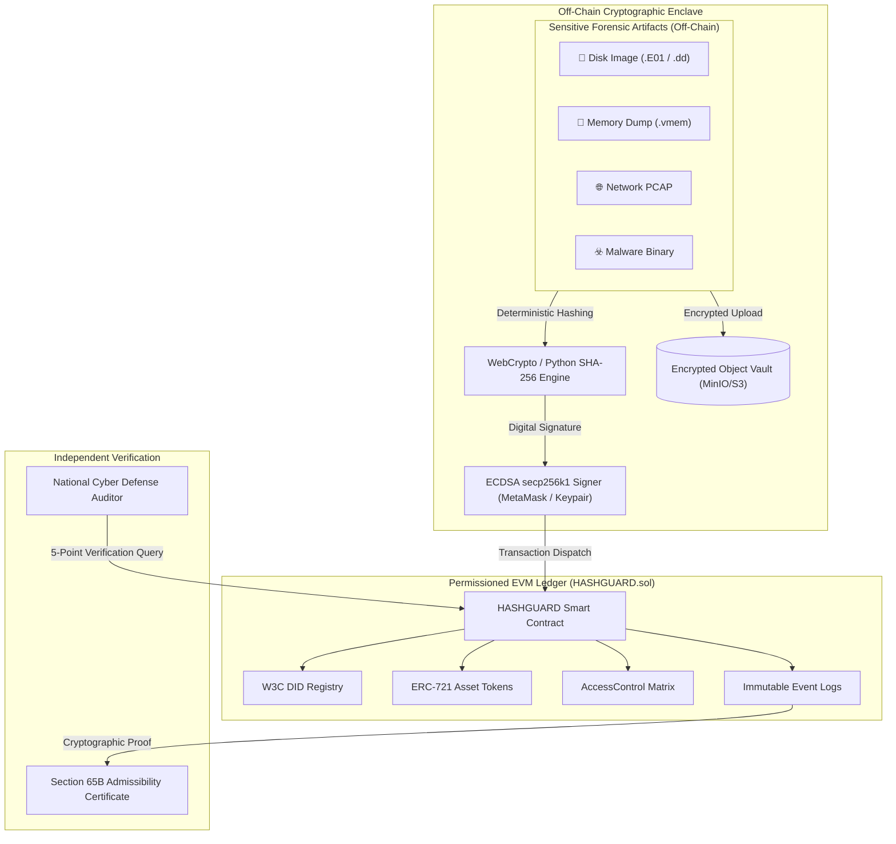
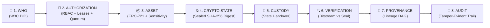
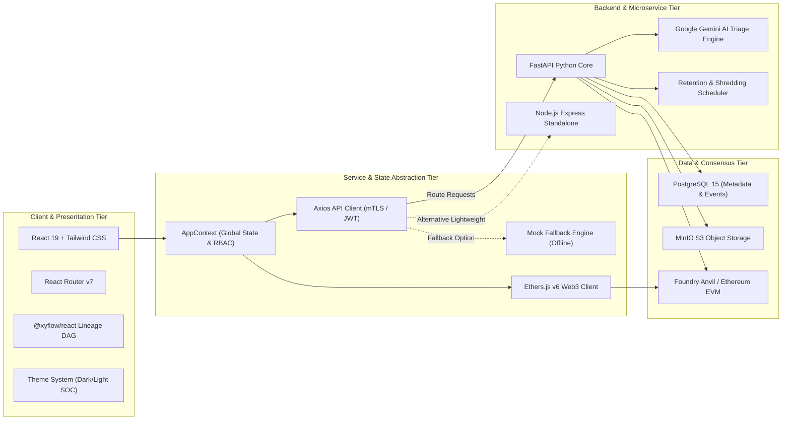
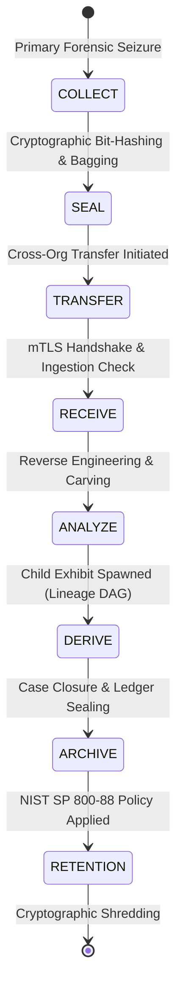
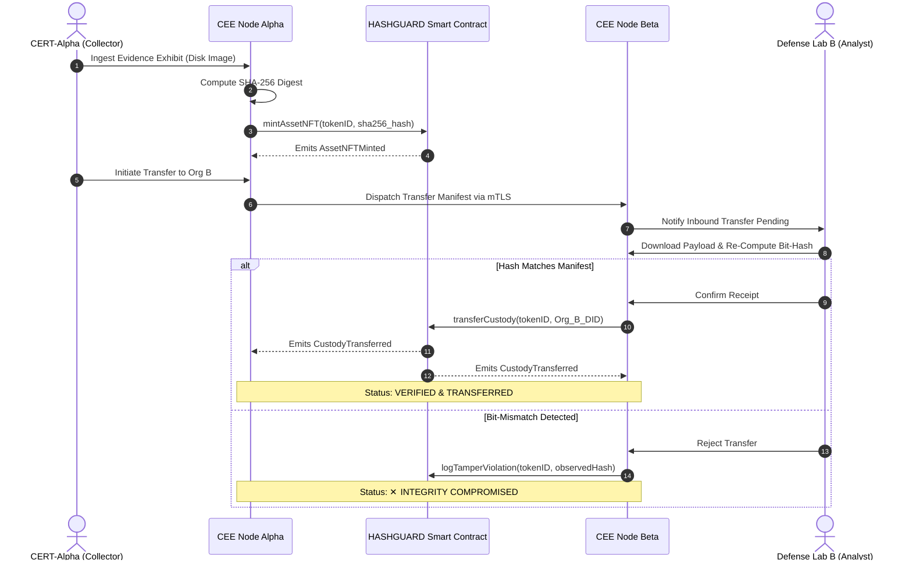

<div align="center">

  # 🛡️ HASHGUARD
  ### Enterprise Digital Asset Trust Layer • W3C Decentralized Identity • Smart Contract Governance

  <p align="center">
    <b>Smart India Hackathon (SIH) 2026 • Problem Statement 26125</b><br>
    <i>"Blockchain-Based Secure Platform for Identity, Access Control, and Digital Asset Management"</i>
  </p>

  <p align="center">
    <a href="https://www.sih.gov.in/"></a>
    <a href="#-the-core-philosophy-trust-continuity-across-the-asset-lifecycle"></a>
    <a href="https://www.w3.org/TR/did-core/"></a>
    <a href="contracts/HASHGUARD.sol"></a>
    <a href="https://opensource.org/licenses/MIT"></a>
  </p>

  <p align="center">
    <a href="https://react.dev/"></a>
    <a href="https://vitejs.dev/"></a>
    <a href="https://tailwindcss.com/"></a>
    <a href="https://fastapi.tiangolo.com/"></a>
    <a href="https://www.postgresql.org/"></a>
    <a href="https://min.io/"></a>
    <a href="https://docs.ethers.org/v6/"></a>
    <a href="https://www.iso.org/standard/44381.html"></a>
    <a href="https://csrc.nist.gov/publications/detail/sp/800-88/rev-1/final"></a>
  </p>

  <br />

  **A high-assurance, cross-organization digital asset trust platform engineered to guarantee verifiable identity, adaptive authorization, cryptographic integrity, chain of custody, and provenance tracking across enterprise consortia, law enforcement, defense laboratories, and judicial bodies.**

  <br />

  > *"Don't just trust the digital asset. Verify it."*  
  > **Trust Continuity across the complete digital asset lifecycle.**

  <br />

  **[ 🪪 Asset Trust Passport ](#-asset-trust-passport-primary-product-view)** &nbsp;•&nbsp; 
  **[ 🧪 Security Validation Lab ](#-hashguard-security-validation-lab)** &nbsp;•&nbsp; 
  **[ 🏗️ System Architecture ](#-system-architecture--data-segregation)** &nbsp;•&nbsp; 
  **[ 🧭 Route Directory ](#-platform-showcase--route-directory)** &nbsp;•&nbsp; 
  **[ 📜 Smart Contracts ](#-smart-contract-deep-dive)** &nbsp;•&nbsp; 
  **[ 🔬 Testing Guide ](#-step-by-step-verification--testing-guide)** &nbsp;•&nbsp; 
  **[ ⚡ Quickstart ](#-quickstart--deployment-guide)**

</div>

---

## 📌 Table of Contents

- [Executive Summary & Problem Statement 26125](#-executive-summary--problem-statement-26125)
  - [The SIH 2026 Problem Statement Context](#the-sih-2026-problem-statement-context)
  - [Platform Positioning: Generalized Digital Asset Trust](#platform-positioning-generalized-digital-asset-trust)
  - [The Core Philosophy: Trust Continuity Across the Asset Lifecycle](#the-core-philosophy-trust-continuity-across-the-asset-lifecycle)
- [Key Features & Innovations](#-key-features--innovations)
  - [Asset Trust Passport (Primary Product View)](#-asset-trust-passport-primary-product-view)
  - [Adaptive Asset Authorization & Sensitivity Tiers](#-adaptive-asset-authorization--sensitivity-tiers)
  - [Time-Bound Temporary Leases](#-time-bound-temporary-leases)
  - [Application-Level Quorum Gate (2-of-3 Consensual Approval)](#-application-level-quorum-gate-2-of-3-consensual-approval)
  - [Consortium Revocation Cascade](#-consortium-revocation-cascade)
  - [HashGuard Security Validation Lab](#-hashguard-security-validation-lab)
  - [Core Platform Baseline Capabilities](#-core-platform-baseline-capabilities)
- [System Architecture & Data Segregation](#-system-architecture--data-segregation)
  - [Off-Chain vs. On-Chain Segregation Model](#off-chain-vs-on-chain-segregation-model)
  - [Trust Continuity Lifecycle Pipeline](#trust-continuity-lifecycle-pipeline)
  - [Architectural Boundary & Enforcement Matrix](#architectural-boundary--enforcement-matrix)
  - [System Flow & Layered Architecture](#system-flow--layered-architecture)
  - [Custody State Machine Lifecycle](#custody-state-machine-lifecycle)
  - [Cross-Organization Transfer Protocol](#cross-organization-transfer-protocol)
- [Platform Showcase & Route Directory](#-platform-showcase--route-directory)
- [Technology Stack](#-technology-stack)
- [Retention Management & Legal Hold Preservation](#-retention-management--legal-hold-preservation)
  - [Retention Policy Architecture & Presets](#retention-policy-architecture--presets)
  - [Legal Hold Preservation Orders & Deletion Guards](#legal-hold-preservation-orders--deletion-guards)
  - [Tamper-Evident Audit Ledger Retention Events](#tamper-evident-audit-ledger-retention-events)
- [Organization vs. RBAC Role Separation Architecture](#-organization-vs-rbac-role-separation-architecture)
  - [The 5 Participating Organizations (WHERE)](#the-5-participating-organizations-where)
  - [The 6 Distinct RBAC Roles (WHAT)](#the-6-distinct-rbac-roles-what)
  - [Granular RBAC Permissions Matrix](#granular-rbac-permissions-matrix)
- [Smart Contract Deep Dive](#-smart-contract-deep-dive)
  - [Active Deployed Contract (`HASHGUARD.sol` v1.0)](#1-active-deployed-contract-hashguardsol-v10)
    - [Decentralized Identifiers (W3C DID v1.0)](#decentralized-identifiers-w3c-did-v10)
    - [NFT-Based Asset Ownership (ERC-721)](#nft-based-asset-ownership-erc-721)
    - [On-Chain Role-Based Access Control (RBAC)](#on-chain-role-based-access-control-rbac)
    - [On-Chain Audit Events](#on-chain-audit-events)
  - [Versioned Extension Proposal (`HashGuard_v2_1_Proposal.sol`)](#2-versioned-extension-proposal-hashguard_v2_1_proposalsol)
    - [Architectural Motivation & Specification](#architectural-motivation--specification)
    - [Native On-Chain Quorum Gate (2-of-3 Multisig)](#native-on-chain-quorum-gate-2-of-3-multisig)
    - [Phased Migration Protocol (v1.0 → v2.1)](#phased-migration-protocol-v10--v21)
- [Backend API Reference](#-backend-api-reference)
- [Quickstart & Deployment Guide](#-quickstart--deployment-guide)
  - [Prerequisites](#prerequisites)
  - [Method 1: Instant Evaluation (Frontend + Zero-Config Offline Sandbox)](#method-1-instant-evaluation-frontend--zero-config-offline-sandbox)
  - [Method 2: Standalone Node.js Microservice Backend](#method-2-standalone-nodejs-microservice-backend)
  - [Method 3: Production Docker Compose Enterprise Stack](#method-3-production-docker-compose-enterprise-stack)
- [Step-by-Step Verification & Testing Guide](#-step-by-step-verification--testing-guide)
  - [Security Validation Lab Protocol (Scenarios 1–4)](#security-validation-lab-protocol-scenarios-14)
    - [Scenario 1: Tampered Evidence Injection](#scenario-1-tampered-evidence-injection)
    - [Scenario 2: Unauthorized Custody Transfer](#scenario-2-unauthorized-custody-transfer)
    - [Scenario 3: Revoked Identity Operation](#scenario-3-revoked-identity-operation)
    - [Scenario 4: Expired Temporary Access](#scenario-4-expired-temporary-access)
  - [Platform Integrity & Governance Verification (TEST 1 – TEST 7)](#platform-integrity--governance-verification-test-1--test-7)
- [Interactive Tamper Simulation & Verification](#-interactive-tamper-simulation--verification)
- [AI Threat Triage Integration](#-ai-threat-triage-integration)
- [Legal, Regulatory & Standards Admissibility](#-legal-regulatory--standards-admissibility)
- [Project Directory Structure](#-project-directory-structure)
- [Contributing & Security Policy](#-contributing--security-policy)
- [License](#-license)

---

## 📖 Executive Summary & Problem Statement 26125

### The SIH 2026 Problem Statement Context
**Smart India Hackathon 2026 — Problem Statement 26125**:  
*"Blockchain-Based Secure Platform for Identity, Access Control, and Digital Asset Management."*

The core problem challenges engineering teams to design an enterprise-grade, decentralized architecture that guarantees:
- **Decentralized Identity**: Cryptographic verification of human and system actors without single-point IAM dependencies.
- **Granular Access Control & RBAC**: Strict separation of duties, least-privilege enforcement, and verifiable access policies.
- **Digital Asset Ownership & Governance**: Cryptographically non-fungible asset representation, transparent provenance, and auditable custody transfers.
- **Smart Contract Execution**: Autonomous, deterministic enforcement of lifecycle rules and audit records anchored to a blockchain ledger.
- **Mitigating Centralized Trust**: Removing single points of administrative compromise across multi-organization operational exchanges.

### Platform Positioning: Generalized Digital Asset Trust

> [!IMPORTANT]
> **Not Just Digital Forensics — A Generalized Digital Asset Trust Engine**  
> While cyber forensic evidence serves as our primary demonstration use case due to its extreme chain-of-custody and admissibility requirements, HashGuard is architected as a **generalized digital-asset trust layer** for any high-assurance enterprise, financial, defense, or judicial consortium.

The platform provides a unified trust foundation across 7 foundational requirements:
1. **Verifiable Identity (WHO)**: W3C Decentralized Identifiers (DIDs) cryptographically bound to institutional actors.
2. **Adaptive Authorization (PERMISSIONS)**: Role-Based Access Control, asset sensitivity tiers, and time-bound temporary leases.
3. **Cryptographic Integrity (SEAL)**: Deterministic SHA-256 bitstream hashing with off-chain/on-chain segregation.
4. **Ownership & Custody (TRACKING)**: ERC-721 tokenized asset ownership and audited custody transitions across organizational boundaries.
5. **Continuous Provenance (LINEAGE)**: Mathematical derivation DAGs mapping root assets to derived analytical artifacts.
6. **Independent Verification (ZERO-TRUST)**: Public, verifiable mathematical proofs that allow external third parties to validate authenticity without accessing raw sensitive bytes.
7. **Tamper-Evident Audit Trail (AUDIT)**: Sequentially indexed event logs anchored to the blockchain.

### The Core Philosophy: Trust Continuity Across the Asset Lifecycle

> [!TIP]
> **"Don't just trust the digital asset. Verify it."**  
> In modern security architectures, a static checklist of buzzwords (*"we have a blockchain, DIDs, and SHA-256"*) is no longer sufficient. Real-world adversaries exploit the seams *between* systems. HashGuard guarantees **Trust Continuity**: verifying the complete causal chain across the entire digital asset lifecycle:

```
WHO IS ACTING? (W3C DID)
       ↓
WHAT ARE THEY AUTHORIZED TO DO? (RBAC + Sensitivity Tiers + Temporary Leases)
       ↓
WHAT ASSET ARE THEY HANDLING? (ERC-721 Token ID & Metadata)
       ↓
WHAT WAS THE ORIGINAL CRYPTOGRAPHIC STATE? (Sealed SHA-256 On-Chain Root)
       ↓
WHO HAD CUSTODY? (Deterministic Custody State Machine)
       ↓
WAS THE ASSET CHANGED? (Off-Chain Bitstream Digest vs. On-Chain Seal)
       ↓
WHAT WAS DERIVED FROM IT? (Interactive Provenance DAG)
       ↓
CAN ANOTHER PARTY VERIFY THE HISTORY? (Independent Verification & Tamper-Evident Audit Trail)
```

---

## ⚡ Key Features & Innovations

### 🪪 Asset Trust Passport (Primary Product View)
The **Asset Trust Passport** (`/passport`, `/passport/:id`) is HashGuard's central operational view, providing a comprehensive, single-pane-of-glass evaluation of any digital asset's health across the **6 Trust Pillars**:
- **Pillar 1: Identity (WHO)** — Owner DID, current custodian organization, and originating entity.
- **Pillar 2: Integrity (SEAL)** — Side-by-side SHA-256 comparison between the immutable on-chain root seal and the observed off-chain bitstream digest.
- **Pillar 3: Authorization (POLICY)** — Sensitivity tier classification, required governance threshold, and active temporary leases.
- **Pillar 4: Custody (CHAIN OF CUSTODY)** — Current custodian node, transfer status, and historical handover sequence.
- **Pillar 5: Provenance (LINEAGE DAG)** — Parent-to-child derivation linkages, carved sub-artifacts, and lineage integrity.
- **Pillar 6: Audit (TAMPER-EVIDENT TRAIL)** — Block height anchor, genesis timestamp, and verifiable transaction proofs.

The Passport features a **3-level progressive disclosure architecture**:
1. **Level 1 (Verdict Hero)**: Immediate binary trust assessment (`TRUST VERIFIED` vs. `TRUST COMPROMISED`) with clear status rationale and off-chain/on-chain trust boundary indicators.
2. **Level 2 (Six Pillar Cards)**: Comprehensive architectural breakdown of identity, cryptographic state, access rules, custody lifecycle, provenance, and audit logs.
3. **Level 3 (Progressive Disclosure Technical Panel)**: Collapsible deep-dive showing storage URIs, off-chain enclave parameters, public key fingerprints, and raw smart contract references.
4. **Cryptographic Verification Report Export**: 1-click generation of a court-ready, timestamped JSON verification dossier detailing all 6 pillars and signed proofs.

### 🛡️ Adaptive Asset Authorization & Sensitivity Tiers
Rather than treating all assets identically, HashGuard implements adaptive risk classification via **Access & Governance** (`/access-governance`):
- **`STANDARD`**: Normal operational assets governed by baseline RBAC permissions.
- **`RESTRICTED`**: Confidential assets requiring explicit identity whitelisting or temporary authorization leases.
- **`CRITICAL`**: High-impact assets (e.g., weaponized malware source, national security exhibits) requiring time-bound leases and consensual multi-party sign-off.

### ⏱️ Time-Bound Temporary Leases
Allows administrators and custodians to grant emergency or short-term operational access to investigators and external defense labs:
- **Monotonic Expiry**: Configurable lease duration (e.g., 2, 4, 8, 24 hours) enforced against monotonically increasing timestamps.
- **Auto-Expiration**: Leases automatically expire without requiring manual revocation commands. Expired leases trigger immediate access denials.
- **Audited Issuance**: Every lease grant is anchored with the grantee's DID, justified reason, and expiration timestamp.

### 🏛️ Application-Level Quorum Gate (2-of-3 Consensual Approval)
To prevent rogue insiders or compromised administrative keys from unilaterally transferring sensitive exhibits, HashGuard enforces an **Application-Level Quorum Gate**:
- **Critical Asset Custody Protection**: Any custody transfer dispatch for `CRITICAL` assets is locked in a `PENDING_APPROVAL` holding state.
- **Consensual Threshold**: Requires 2 distinct authorized institutional nodes (e.g., CERT-Alpha + Cyber Defense Lab) to review and approve the transfer manifest before physical and ledger custody dispatch is permitted.
- **Transparent Status**: Real-time progress visualizer shows current approval counts and pending signatories.
*(Explicitly documented and enforced as application-level consortium governance in the current v1.0 architecture).*

### ⚡ Consortium Revocation Cascade
When an investigator key or agency node is compromised, revocation must be immediate and systemic:
- **Zero-Trust Cascade**: Revoking an entity's DID immediately cascades through the state layer—instantly invalidating all active role bindings, voiding all active temporary leases across all assets, and blocking any pending custody transfers.
- **Deterministic Enforcement**: Subsequent requests by the revoked identity are rejected with HTTP 403 Forbidden.
- **Preserved History**: While future actions are strictly blocked, all prior historical actions and evidence seals created before the revocation remain cryptographically intact in the tamper-evident audit trail.

### 🧪 HashGuard Security Validation Lab
Located at `/security-lab`, the **Security Validation Lab** provides evaluators with a deterministic adversarial test bench executing 4 core security failure and attack scenarios against the live state machine:
1. **Test 01: Tampered Evidence Injection** (Bitstream digest mismatch detection & download blocking).
2. **Test 02: Unauthorized Custody Transfer** (Critical transfer attempt without 2-of-3 Quorum Gate sign-off blocked).
3. **Test 03: Revoked Identity Operation** (Revoked DID attempting custody operations rejected via Revocation Cascade).
4. **Test 04: Expired Temporary Access** (Elapsed lease token rejected at temporal boundary).

Each test executes real underlying state and cryptographic validations, advancing through a clear tri-state lifecycle:  
**`1. DETECTED` ➔ `2. BLOCKED` ➔ `3. AUDITED`**.

### 🌟 Core Platform Baseline Capabilities
- **🔐 Privacy-Preserving Off-Chain Enclave Architecture**: Sensitive gigabyte-scale disk images, malware binaries, and memory dumps remain securely in encrypted off-chain object storage (MinIO / S3). Only deterministic SHA-256 digests, ECDSA signatures, and state proofs are anchored on-chain.
- **🆔 Self-Sovereign Decentralized Identifiers (W3C DID v1.0)**: Eliminates centralized IAM dependencies. Custodians, analysts, and auditors are bound to cryptographic DIDs (`did:ethr:<address>`) with on-chain DID Document hash anchoring.
- **🪙 NFT-Backed Evidence Ownership (ERC-721)**: Unique forensic exhibits are minted as on-chain non-fungible tokens, providing non-duplicable, transparent ownership and strictly serialized transfer receipts.
- **🛡️ Bytecode-Enforced RBAC**: Granular roles (`ROLE_ADMIN`, `ROLE_MANAGER`, `ROLE_AUDITOR`, `ROLE_USER`) are strictly enforced at the EVM smart contract execution level with zero-trust privilege boundaries.
- **🌐 Interactive Forensic Lineage DAG**: Powered by `@xyflow/react`, this interactive directed acyclic graph visualizes the entire life cycle of derived evidence—from primary seized payloads to decompilations, carved files, YARA/Sigma rules, and courtroom executive summaries.
- **🔍 5-Point Zero-Trust Auditor Suite**: Independent verification engine that validates bit-level **Hash Integrity**, **ECDSA Signatures**, **Custody Continuity**, **Sequential Monotonicity**, and **DAG Lineage** without leaking file contents. Generates exportable, court-ready verification reports.
- **🚨 Real-Time Bit-Level Tamper Simulator**: Interactive top-bar toggle that simulates a bit-level specimen modification in real time. Instantly flips system-wide statuses to `✕ INTEGRITY COMPROMISED` and exposes the failure cascade in the auditor portal.
- **🤖 Gen-AI Forensic Threat Triage**: Embedded neural triage powered by Google Gemini (`gemini-1.5-flash` / `gemini-pro`) to analyze Shannon entropy, identify binary packing, extract MITRE ATT&CK indicators, and parse IOCs from investigator notes.
- **⏳ NIST SP 800-88 Compliant Retention & Shredding**: Automated life cycle retention schedules, administrative legal hold lockdowns, and verifiable cryptographic media eradication logging.
- **🌗 Persistent SOC High-Contrast Theme System**: Sleek forensic dark mode and high-contrast light mode with real-time UI switching and persistent local preferences.
- **🎯 1-Click Sandbox Evaluation Route (`/sandbox`)**: Instant automated authentication as Lead Forensic Investigator with realistic forensic datasets for seamless review and evaluation without manual setup.

---

## 🏗️ System Architecture & Data Segregation

### Off-Chain vs. On-Chain Segregation Model

Digital forensic artifacts typically range from hundreds of megabytes to multiple terabytes in size. Ingesting raw payloads into a blockchain would be computationally prohibitive, cost-inefficient, and would violate data privacy regulations. HASHGUARD implements an air-tight segregation model:

| Layer | Component | Contents & Operations | Cryptographic Guarantee |
|---|---|---|---|
| **Off-Chain Storage Vault** | MinIO / S3 / Encrypted Enclave | Disk images (`.E01`, `.dd`), PCAP captures, memory dumps (`.vmem`), malware binaries, decompiled artifacts | AES-256-GCM rest encryption, strict presigned URL access, local hardware storage |
| **Off-Chain Crypto Engine** | WebCrypto / Python Cryptography | Client-side chunked SHA-256 bit digest hashing, secp256k1 ECDSA digital signatures | Deterministic zero-leakage payload fingerprinting |
| **On-Chain Audit Ledger** | EVM Smart Contract (`HASHGUARD.sol`) | SHA-256 Bit Hashes, W3C DIDs, ERC-721 Token IDs, Custody State Machine Transitions, RBAC Assignments | Immutability, non-repudiation, tamper-evident event emission, consensus timestamping |


```mermaid
flowchart TD
    subgraph RawArtifacts ["Sensitive Forensic Artifacts (Off-Chain)"]
        F1["💾 Disk Image (.E01 / .dd)"]
        F2["🧠 Memory Dump (.vmem)"]
        F3["🌐 Network PCAP"]
        F4["☣️ Malware Binary"]
    end

    subgraph OffChainEngine ["Off-Chain Cryptographic Enclave"]
        CRYPTO["WebCrypto / Python SHA-256 Engine"]
        VAULT[("Encrypted Object Vault (MinIO/S3)")]
        HSM["ECDSA secp256k1 Signer (MetaMask / Keypair)"]
        
        RawArtifacts -->|Encrypted Upload| VAULT
        RawArtifacts -->|Deterministic Hashing| CRYPTO
        CRYPTO -->|Digital Signature| HSM
    end

    subgraph OnChainLedger ["Permissioned EVM Ledger (HASHGUARD.sol)"]
        CONTRACT["HASHGUARD Smart Contract"]
        DID_REG["W3C DID Registry"]
        NFT_REG["ERC-721 Asset Tokens"]
        RBAC["AccessControl Matrix"]
        EVENTS["Immutable Event Logs"]

        HSM -->|Transaction Dispatch| CONTRACT
        CONTRACT --> DID_REG
        CONTRACT --> NFT_REG
        CONTRACT --> RBAC
        CONTRACT --> EVENTS
    end

    subgraph AuditorZone ["Independent Verification"]
        AUDITOR["National Cyber Defense Auditor"]
        CERT["Section 65B Admissibility Certificate"]
        
        AUDITOR -->|5-Point Verification Query| CONTRACT
        EVENTS -->|Cryptographic Proof| CERT
    end
```

> **Key Architectural Axiom**: **RAW DATA STAYS OFF-CHAIN. TRUST IS ANCHORED ON-CHAIN.**  
> Sensitive gigabyte-scale disk images, malware binaries, and memory dumps remain securely in local/cloud enclaves. The blockchain functions exclusively as a trust anchor recording cryptographic hashes, digital signatures, identity bindings, and state transitions.

---

### Trust Continuity Lifecycle Pipeline

HashGuard replaces fragmented access logs and isolated verification checks with an unbroken causal pipeline:


```mermaid
flowchart LR
    A["👤 1. WHO<br/>(W3C DID)"] --> B["🔑 2. AUTHORIZATION<br/>(RBAC + Leases + Quorum)"]
    B --> C["📦 3. ASSET<br/>(ERC-721 + Sensitivity)"]
    C --> D["🔒 4. CRYPTO STATE<br/>(Sealed SHA-256 Digest)"]
    D --> E["🤝 5. CUSTODY<br/>(State Handover)"]
    E --> F["🔍 6. VERIFICATION<br/>(Bitstream vs Seal)"]
    F --> G["🌳 7. PROVENANCE<br/>(Lineage DAG)"]
    G --> H["📜 8. AUDIT<br/>(Tamper-Evident Trail)"]
```

| Lifecycle Stage | Architectural Question | System Guarantee & Implementation Mechanism |
|---|---|---|
| **1. WHO** | Who is acting? | W3C Decentralized Identifiers (`did:ethr:<address>`) with on-chain DID Document registry. |
| **2. AUTHORIZATION** | What are they authorized to do? | On-chain RBAC roles combined with application-level adaptive sensitivity tiers, time-bound temporary leases, and multi-party quorum gates. |
| **3. ASSET** | What asset are they handling? | Unique ERC-721 tokenized digital exhibits with bound acquisition metadata and classification tags. |
| **4. CRYPTO STATE** | What was the original cryptographic state? | Deterministic SHA-256 bitstream digest sealed on-chain during genesis ingestion. |
| **5. CUSTODY** | Who holds physical & legal custody? | Deterministic custody state machine tracking cross-organization transfers with sender/receiver attestation. |
| **6. VERIFICATION** | Was the asset modified or corrupted? | Client-side chunked hash recomputation compared against the immutable on-chain sealed root. |
| **7. PROVENANCE** | What sub-artifacts were derived? | Directed Acyclic Graph (DAG) preserving cryptographic links between parents and carved artifacts. |
| **8. AUDIT** | Can external parties verify the history? | Tamper-evident, indexed EVM transaction event logs providing mathematical non-repudiation. |

---

### Architectural Boundary & Enforcement Matrix

To ensure absolute technical transparency during evaluation, HashGuard strictly demarcates which guarantees are enforced at the smart-contract bytecode layer versus the application/gateway layer:

| Capability / Mechanism | Enforcement Level | Architectural Implementation | Production Rationale |
|---|---|---|---|
| **Asset Tokenization & Ownership** | **On-Chain (Smart Contract)** | `contracts/HASHGUARD.sol` (`ERC721`) | Provides non-fungible, non-duplicable asset ownership anchored to EVM consensus. |
| **Bitstream SHA-256 Root Seal** | **On-Chain (Smart Contract)** | `contentHash` mapping in `HASHGUARD.sol` | Guarantees tamper-evident, permanent root reference that cannot be altered by root admins. |
| **Actor Identity Binding** | **On-Chain (Smart Contract)** | `didRegistry` mapping in `HASHGUARD.sol` | W3C DID Document hash anchor ensuring cryptographically verifiable actors. |
| **Role-Based Access Control (RBAC)** | **On-Chain (Smart Contract)** | OpenZeppelin `AccessControl` bytecode | Core operational permissions (`ROLE_ADMIN`, `ROLE_MANAGER`, `ROLE_AUDITOR`, `ROLE_USER`) enforced on-chain. |
| **Audit Ledger Event Emission** | **On-Chain (Smart Contract)** | Indexed EVM events (`CustodyTransferred`, etc.) | Creates permanent, chronological transaction logs for external blockchain explorers. |
| **Asset Sensitivity Tiers** | **Application-Level Enforced** | `src/services/evidenceService.js` | Classifies exhibits (`STANDARD`, `RESTRICTED`, `CRITICAL`) to gate operational pipelines without contract redeployment. |
| **Time-Bound Temporary Leases** | **Application-Level Enforced** | `evidenceService.js` & `AppContext.jsx` | Issues temporary leases evaluated against monotonic timestamps for auto-expiry. |
| **Consortium Revocation Cascade** | **Application-Level Enforced** | `AppContext.jsx` & `transferService.js` | Instantly zeroes downstream roles/leases and blocks pending transfers upon DID revocation. |
| **Quorum Gate (2-of-3 Approval)** | **Application-Level Enforced** | `transferService.js` (`TR-010-CRITICAL`) | Enforces consensual multi-party sign-off on Critical custody transfers before execution. |
| **Native On-Chain Multisig Quorum** | **Versioned Proposal (v2.1)** | `contracts/HashGuard_v2_1_Proposal.sol` | Formal specification for compiling multi-party quorum and dynamic leases directly into EVM bytecode. |

---

### System Flow & Layered Architecture


```mermaid
flowchart LR
    subgraph Client ["Client & Presentation Tier"]
        UI["React 19 + Tailwind CSS"]
        ROUTER["React Router v7"]
        DAG["@xyflow/react Lineage DAG"]
        THEME["Theme System (Dark/Light SOC)"]
    end

    subgraph ServiceLayer ["Service & State Abstraction Tier"]
        APP_CTX["AppContext (Global State & RBAC)"]
        API_CLIENT["Axios API Client (mTLS / JWT)"]
        FALLBACK["Mock Fallback Engine (Offline)"]
        WEB3_CLI["Ethers.js v6 Web3 Client"]
    end

    subgraph BackendTier ["Backend & Microservice Tier"]
        FAST_API["FastAPI Python Core"]
        NODE_API["Node.js Express Standalone"]
        AI_MOD["Google Gemini AI Triage Engine"]
        SCHED["Retention & Shredding Scheduler"]
    end

    subgraph DataStorage ["Data & Consensus Tier"]
        PG["PostgreSQL 15 (Metadata & Events)"]
        S3["MinIO S3 Object Storage"]
        EVM["Foundry Anvil / Ethereum EVM"]
    end

    UI --> APP_CTX
    APP_CTX --> API_CLIENT
    APP_CTX --> WEB3_CLI
    API_CLIENT -->|Route Requests| FAST_API
    API_CLIENT -.->|Fallback Option| FALLBACK
    API_CLIENT -.->|Alternative Lightweight| NODE_API

    FAST_API --> AI_MOD
    FAST_API --> SCHED
    FAST_API --> PG
    FAST_API --> S3
    FAST_API --> EVM
    WEB3_CLI --> EVM
```

---

### Custody State Machine Lifecycle

Every forensic exhibit follows a strict, non-reversible deterministic state machine. State mutations trigger indexed blockchain events:


```mermaid
stateDiagram-v2
    [*] --> COLLECT : Primary Forensic Seizure
    COLLECT --> SEAL : Cryptographic Bit-Hashing & Bagging
    SEAL --> TRANSFER : Cross-Org Transfer Initiated
    TRANSFER --> RECEIVE : mTLS Handshake & Ingestion Check
    RECEIVE --> ANALYZE : Reverse Engineering & Carving
    ANALYZE --> DERIVE : Child Exhibit Spawned (Lineage DAG)
    DERIVE --> ARCHIVE : Case Closure & Ledger Sealing
    ARCHIVE --> RETENTION : NIST SP 800-88 Policy Applied
    RETENTION --> [*] : Cryptographic Shredding
```

---

### Cross-Organization Transfer Protocol


```mermaid
sequenceDiagram
    autonumber
    actor Alice as CERT-Alpha (Collector)
    participant CEE_A as CEE Node Alpha
    participant Ledger as HASHGUARD Smart Contract
    participant CEE_B as CEE Node Beta
    actor Bob as Defense Lab B (Analyst)

    Alice->>CEE_A: Ingest Evidence Exhibit (Disk Image)
    CEE_A->>CEE_A: Compute SHA-256 Digest
    CEE_A->>Ledger: mintAssetNFT(tokenID, sha256_hash)
    Ledger-->>CEE_A: Emits AssetNFTMinted
    Alice->>CEE_A: Initiate Transfer to Org B
    CEE_A->>CEE_B: Dispatch Transfer Manifest via mTLS
    CEE_B->>Bob: Notify Inbound Transfer Pending
    Bob->>CEE_B: Download Payload & Re-Compute Bit-Hash
    alt Hash Matches Manifest
        Bob->>CEE_B: Confirm Receipt
        CEE_B->>Ledger: transferCustody(tokenID, Org_B_DID)
        Ledger-->>CEE_A: Emits CustodyTransferred
        Ledger-->>CEE_B: Emits CustodyTransferred
        Note over CEE_A,CEE_B: Status: VERIFIED & TRANSFERRED
    else Bit-Mismatch Detected
        Bob->>CEE_B: Reject Transfer
        CEE_B->>Ledger: logTamperViolation(tokenID, observedHash)
        Note over CEE_A,CEE_B: Status: ✕ INTEGRITY COMPROMISED
    end
```

---

## 🧭 Platform Showcase & Route Directory

The platform provides a responsive, single-page application built on React 19, modularized with role guards, modal drawers, and export pipelines:

| Route | Page | Purpose & Capabilities | Allowed Roles |
|---|---|---|---|
| `/landing` | **Platform Landing & Showcase** | High-impact overview of platform architecture, security guarantees, standards compliance, and live demo launch pad. | Public |
| `/login` | **Unified Authentication & DID Portal** | Multi-persona authentication portal supporting traditional credentials or Web3 DID wallet identity binding. | Public |
| `/sandbox` | **1-Click Reviewer Sandbox** | Automatically provisions a Lead Forensic Investigator session, seeds realistic forensic datasets, and opens the SOC Dashboard. | Public / Evaluators |
| `/dashboard` | **Forensic SOC Operations Dashboard** | High-level situational awareness: KPI counters (Total Evidence, Intact Seals, Active Transfers, Tamper Alerts), active custody pipeline, and quick actions. | Admin, Manager, Auditor, Custodian |
| `/passport`, `/passport/:id` | **Asset Trust Passport (Primary View)** | Unified 6-pillar trust passport (Identity, Integrity, Authorization, Custody, Provenance, Audit) with 3-level progressive disclosure and Cryptographic Verification Report export. | Admin, Manager, Auditor, Custodian |
| `/security-lab` | **Security Validation Lab** | Deterministic adversarial testing suite executing 4 live failure/attack tests with real-time `DETECTED` ➔ `BLOCKED` ➔ `AUDITED` status indicators. | Admin, Manager, Auditor, Custodian |
| `/evidence`, `/evidence/:id` | **Digital Asset Repository & Dossier** | Multi-attribute filtering, drag-and-drop ingestion, side-by-side SHA-256 hash comparison, HSM signatures, off-chain isolation badge, and Gemini AI Threat Triage. | Admin, Manager, Auditor, Custodian |
| `/access-governance` | **Access & Governance Hub** | Sensitivity tier configuration (Standard/Restricted/Critical), time-bound temporary lease grants with monotonic expiry, and consortium revocation cascade controls. | Admin, Manager |
| `/transfers` | **Cross-Agency Transfer Pipeline** | Active transfer queue, interactive mTLS handshake visualizer, initiate transfer modal, and Application-Level Quorum Gate (2-of-3 Consensual Approval) status. | Admin, Manager, Custodian |
| `/custody` | **Global Custody Explorer** | Searchable chronological audit explorer detailing all custody transitions, actor emails, digital signatures, and transaction roots. | Admin, Manager, Auditor, Custodian |
| `/lineage` | **Evidence Lineage DAG** | Interactive node-based provenance graph (`@xyflow/react`) mapping parent-to-child relationships (Raw Payload → Decompiled Source → YARA Rules → Final Report). | Admin, Manager, Auditor, Custodian |
| `/verification` | **Zero-Trust Auditor Suite** | Independent forensic verification interface executing 5-point verification checklist (`HASH`, `SIGNATURE`, `CUSTODY`, `SEQUENCE`, `LINEAGE`) and generating exportable court certificates. | Admin, Auditor |
| `/audit` | **Tamper-Evident Audit Logs Ledger** | Tabular raw on-chain transaction stream with block height references, sender DIDs, activity types, and CSV export. | Admin, Auditor |
| `/architecture` | **System Architecture Explorer** | Interactive architectural walkthrough detailing off-chain vs on-chain segregation, data flows, and security principles. | Admin, Manager, Auditor, Custodian |
| `/retention` | **Lifecycle Retention & Shredding** | ISO/NIST compliant retention policy manager, legal hold freeze controls, and NIST SP 800-88 cryptographic shredding logs. | Admin, Manager |
| `/settings` | **System & Network Configuration** | Switch active organization context, inspect blockchain node RPC connectivity, configure RBAC roles, and toggle dark/light theme mode. | Admin, Manager, Auditor, Custodian |

---

## 💻 Technology Stack

| Layer | Component | Technologies & Libraries | Version | Role in Architecture |
|---|---|---|---|---|
| **Frontend Core** | Web Application | React, Vite | React 19.2, Vite 8.2 | High-performance reactive UI rendering |
| **Styling & Theme** | User Interface | Tailwind CSS, PostCSS, Lucide Icons | Tailwind 3.4 | Forensic SOC design system, dark/light theme switcher |
| **Visualizations** | Graphs & Analytics | `@xyflow/react`, Recharts | xyflow 12.11, Recharts 3.10 | Interactive Lineage DAG, activity velocity charts |
| **Web3 Client** | Blockchain Interface | Ethers.js | v6.17 | EVM transaction signing, contract ABI invocation, DID lookup |
| **API Client** | HTTP Networking | Axios | v1.19 | REST API communication with automated mock fallback engine |
| **Smart Contract** | EVM Consensus | Solidity, OpenZeppelin Contracts | Solidity ^0.8.20, OZ 5.6 | ERC-721 tokenization, AccessControl RBAC, DID registry |
| **Backend Core** | RESTful Services | FastAPI, Uvicorn, Python | FastAPI 0.110, Python 3.11+ | High-throughput asynchronous backend service APIs |
| **AI Triage** | Threat Intelligence | Google Generative AI (Gemini) | `google-generativeai 0.8.6` | Automated binary entropy & IoC extraction |
| **Relational Database** | Relational Ledger | PostgreSQL, SQLAlchemy | Postgres 15, SQLAlchemy 2.0 | Metadata indexing, user sessions, event caching |
| **Object Storage** | Off-Chain Enclave | MinIO (S3 Compatible) | S3 API v4 | Encrypted storage for disk images, binaries, PCAPs |
| **Blockchain Node** | Local EVM DevNet | Foundry Anvil | Latest | High-speed local EVM node with unlocked accounts |
| **Micro Backend** | Standalone Testing | Node.js Express | Express 4, Node 18+ | Zero-dependency standalone JSON-backed REST API |
| **Containers** | Infrastructure | Docker, Docker Compose | Compose v3.8 | Turnkey multi-container orchestration |

---

## ⚖️ Retention Management & Legal Hold Preservation

In forensic incident response and judicial prosecution, evidence lifecycle governance is governed by strict legal rules (NIST SP 800-88 Rev. 1, ISO/IEC 27037:2012, and criminal procedural discovery mandates). Evidence cannot simply be retained indefinitely or deleted arbitrarily. HASHGUARD implements an automated, cryptographically audited **Retention Management & Legal Hold Engine**.

### Retention Policy Architecture & Presets

Administrators and Evidence Custodians configure granular retention policies through **Admin → Retention** (`/retention`). Every policy governs how long evidence remains active, what events initiate its lifecycle countdown, and what action occurs upon expiry.

| Preset Policy Name | Retention Period | Trigger Event | Action on Expiry | Legal Hold Override |
|---|---|---|---|---|
| **Active Investigation Evidence** | 365 Days (1 Year) | `Evidence Sealed (Creation)` | `Notify Custodian for Review` | Enabled (`true`) |
| **Closed Case Evidence** | 180 Days (6 Months) | `Case Closed` | `Archive to Cold Storage` | Enabled (`true`) |
| **Forensic / Malware Evidence** | 1825 Days (5 Years) | `Evidence Sealed (Creation)` | `Archive to Cold Storage` | Enabled (`true`) |
| **Temporary / Unverified Evidence** | 30 Days (1 Month) | `Evidence Uploaded` | `Purge / Secure Delete (NIST SP 800-88)` | Enabled (`true`) |

#### Policy Configuration Parameters:
- **Policy Name**: Pre-configured or custom case classification.
- **Retention Period (Days)**: Integer duration of active lifecycle.
- **Trigger Event**:
  - `Evidence Uploaded`: Countdown commences immediately upon initial ingest.
  - `Evidence Sealed (Creation)`: Countdown commences upon cryptographic bitstream hashing & sealing.
  - `Case Closed`: Countdown commences once the investigating agency closes the case docket.
  - `Transfer Completed`: Countdown begins upon verified receipt by the destination agency.
  - `Court Admissibility Granted`: Countdown begins when judicial court registry admits the exhibit into evidence.
- **Action on Expiry**:
  - `Archive to Cold Storage`: Encrypted payload moved to deep cold storage, metadata and hashes preserved on-chain.
  - `Purge / Secure Delete (NIST SP 800-88)`: Verifiable cryptographic media sanitization.
  - `Notify Custodian for Review`: Automated notification dispatched to custodian for lifecycle re-evaluation.
  - `Require Multi-Party Approval`: Deletion blocked until multi-agency cryptographic consensus is reached.
- **`[x] Allow Legal Hold Override`**: When checked, authorized legal officers can place evidence under a preservation order that suspends the retention timer and prevents automatic expiry actions.

---

### Legal Hold Preservation Orders & Deletion Guards

A **Legal Hold** (also known as a litigation preservation order) is an urgent legal mandate issued by a judicial body, regulatory authority, or legal counsel requiring an organization to preserve all forms of relevant digital evidence.

```
       +-------------------------------------------------------+
       |             RETENTION COUNTDOWN ACTIVE                |
       |  Expires in: 342 days (Policy: Active Investigation)  |
       +-------------------------------------------------------+
                                  │
                   [ APPLY LEGAL HOLD ORDER ]
                                  │
                                  ▼
       +=======================================================+
       |              ⚖️ LEGAL HOLD ACTIVE                     |
       |   Status: LEGAL HOLD   •   Countdown: SUSPENDED       |
       |   Reason: "Court Preservation Order - Case 2026-9012" |
       |   Protected: Hard Deletion Block Enforced (HTTP 403)  |
       +=======================================================+
                                  │
                  [ RELEASE LEGAL HOLD ORDER ]
                                  │
                                  ▼
       +-------------------------------------------------------+
       |             RETENTION COUNTDOWN RESUMED               |
       |  Expires in: 342 days (Countdown unpaused)            |
       +-------------------------------------------------------+
```

#### Dual-Layer Deletion Protection Hierarchy:
1. **RBAC Guard**: Only users with the `ADMINISTRATOR` role are permitted to execute evidence deletions. All other roles receive an immediate access denial.
2. **Legal Hold Immunity Guard**: If an evidence exhibit is marked with `legalHold: true` or `retentionStatus: 'LEGAL HOLD'`, **it is completely immune to deletion**. Even an Administrator attempting deletion will be blocked by both the client UI and the backend API (HTTP 403 Forbidden: *"DELETION BLOCKED: Evidence exhibit is protected under an active Legal Hold preservation order"*).
3. **Visual Indicators**: Exhibits under hold display a distinct purple `HOLD` badge in the Evidence Repository, a lock icon in place of the delete button, and a dedicated **LEGAL HOLDS (ACTIVE PRESERVATION ORDERS)** monitoring panel on the Retention Dashboard.

---

### Tamper-Evident Audit Ledger Retention Events

Every retention configuration, state change, and legal hold intervention is recorded into the tamper-evident audit ledger (with blockchain-indexed immutability) containing actor DID, timestamp, and transaction proof:

- `RETENTION_POLICY_CREATED`: Emitted when a new lifecycle policy is published.
- `RETENTION_POLICY_UPDATED`: Emitted when retention duration or expiry actions are updated.
- `RETENTION_STARTED`: Emitted when an exhibit is bound to a policy and the retention countdown starts.
- `RETENTION_EXPIRED`: Emitted when retention countdown expires.
- `EVIDENCE_ARCHIVED`: Emitted when an exhibit is transitioned to long-term cold storage.
- `LEGAL_HOLD_APPLIED`: Emitted when a preservation order freezes an evidence exhibit.
- `LEGAL_HOLD_RELEASED`: Emitted when an authorized officer dissolves a preservation order.
- `EVIDENCE_DELETION_APPROVED`: Emitted when multi-party consensus authorizes the deletion of an expired, unprotected exhibit.

---

## 🏛️ Organization vs. RBAC Role Separation Architecture

A core architectural principle of HASHGUARD is the strict separation between **Organization** (WHERE the user belongs / data scope & jurisdiction) and **RBAC Role** (WHAT the user is authorized to perform / operational privileges).

```
   ┌──────────────────────────────────────────────────────────────┐
   │               WHERE: Participating Organization              │
   │      (Agency Data Scope, Geographic Node, mTLS Endpoint)     │
   ├───────────────────┬───────────────────┬──────────────────────┤
   │   Organization A  │   Organization B  │    Organization C    │
   │    (CERT-Alpha)   │  (Cyber Defense)  │   (Judicial Court)   │
   ├───────────────────┼───────────────────┼──────────────────────┤
   │   Organization D  │    Audit Board    │   (Extensible...)    │
   │  (Cyber Police)   │   (Independent)   │                      │
   └───────────────────┴───────────────────┴──────────────────────┘
                                  ▲
                                  │ Independent Binding
                                  ▼
   ┌──────────────────────────────────────────────────────────────┐
   │                 WHAT: Role-Based Access Control              │
   │              (Operational Permissions & Authority)           │
   ├───────────────────┬───────────────────┬──────────────────────┤
   │  First Responder  │ Forensic Analyst  │  Evidence Custodian  │
   ├───────────────────┼───────────────────┼──────────────────────┤
   │   Investigator    │      Auditor      │    Administrator     │
   └───────────────────┴───────────────────┴──────────────────────┘
```

### The 5 Participating Organizations (WHERE)

1. **Organization A — CERT-Alpha**: Computer Emergency Response Team node. Specializes in initial incident triage, live triage memory acquisition, bitstream disk imaging, and mTLS dispatch.
2. **Organization B — Cyber Defense Lab**: State forensic defense laboratory. Specializes in dynamic sandboxing, malware reverse engineering, derived sub-artifact generation, and cryptographic hash verification.
3. **Organization C — Judicial Court Registry**: Judicial registry and forensic vault. Governs legal court exhibits, Section 65B forensic certificates, and legal hold preservation orders.
4. **Organization D — Cyber Crime Police (LEA)**: Law enforcement agency. Governs crime scene raids, First Information Report (FIR) exhibits, and cross-agency chain of custody handoffs.
5. **Audit Board — Independent Oversight**: Independent oversight authority. Maintains an air-gapped, zero-trust observation node to audit hash roots, custody continuity, and retention compliance across all agencies.

### The 6 Distinct RBAC Roles (WHAT)

- **First Responder**: Ingests primary evidence, computes SHA-256 digests, seals evidence manifests, and initiates cross-agency dispatch.
- **Forensic Analyst**: Conducts isolated sandbox analysis, derives child artifacts (L2 lineage), and verifies bit-level integrity.
- **Evidence Custodian**: Accepts inbound custody, administers vault storage, applies/releases legal holds, and issues Section 65B certificates.
- **Investigator**: Logs crime scene exhibits, attaches FIR references, and submits legal hold preservation requests.
- **Auditor**: Executes independent zero-trust cryptographic verifications, inspects raw transaction ledgers, and generates court certificates without receiving administrative or modification privileges.
- **Administrator**: Governs platform retention policies, configures RBAC role bindings, manages smart contract settings, and oversees system health.

### Granular RBAC Permissions Matrix

| Capability / Action | Administrator | Evidence Custodian | Investigator | Forensic Analyst | First Responder | Auditor |
|---|:---:|:---:|:---:|:---:|:---:|:---:|
| **Collect & Ingest Evidence** | ✓ | ✕ | ✓ | ✕ | ✓ | ✕ |
| **Generate SHA-256 Bitstream Digest** | ✓ | ✓ | ✓ | ✓ | ✓ | ✓ |
| **Seal Evidence Manifest** | ✓ | ✓ | ✓ | ✕ | ✓ | ✕ |
| **Dispatch Custody Transfer** | ✓ | ✓ | ✓ | ✓ | ✓ | ✕ |
| **Accept Inbound Transfer** | ✓ | ✓ | ✓ | ✓ | ✕ | ✕ |
| **Sandbox Malware Analysis** | ✓ | ✕ | ✕ | ✓ | ✕ | ✕ |
| **Derive Forensic Artifacts (Lineage DAG)** | ✓ | ✕ | ✕ | ✓ | ✕ | ✕ |
| **Zero-Trust Root Verification** | ✓ | ✓ | ✓ | ✓ | ✓ | ✓ |
| **Manage Retention Policies** | ✓ | ✓ | ✕ | ✕ | ✕ | ✕ |
| **Apply Legal Hold Preservation Order** | ✓ | ✓ | ✓ | ✕ | ✕ | ✕ |
| **Release Legal Hold Order** | ✓ | ✓ | ✕ | ✕ | ✕ | ✕ |
| **Delete Exhibit (Unprotected Only)** | ✓ | ✕ | ✕ | ✕ | ✕ | ✕ |
| **Inspect Ledger, Custody & Lineage** | ✓ | ✓ | ✓ | ✓ | ✓ | ✓ |

> **Key Security Guarantee**: An officer from the `Audit Board — Independent Oversight` with the `Auditor` role has full inspection and zero-trust verification privileges across all agency records, but **cannot modify, delete, or transfer evidence**, maintaining pristine separation of powers.

---

## 📜 Smart Contract Deep Dive

HashGuard's smart contract architecture balances battle-tested, gas-efficient on-chain execution with modular extensibility.

---

### 1. Active Deployed Contract (`HASHGUARD.sol` v1.0)

The active deployed contract [`contracts/HASHGUARD.sol`](contracts/HASHGUARD.sol) is compiled in Solidity `^0.8.20` and extends OpenZeppelin's `ERC721` and `AccessControl`. It serves as the live trust anchor across all integration tests, local Anvil DevNets, and production deployments.

> **Integrity Guarantee**: Preserved 100% intact to guarantee continuous operation of deployed nodes, test suites, and the core cryptographic tamper demonstration.

#### Decentralized Identifiers (W3C DID v1.0)
```solidity
struct UserIdentity {
    string didURI;           // e.g. "did:ethr:0x4B20993Bc481177ec7E8f571ceCaE8A9e22C02db"
    bytes32 didDocumentHash; // keccak256 hash of published DID Document
    uint256 registeredAt;
    bool exists;
}
mapping(address => UserIdentity) public didRegistry;

function registerDID(address user, string memory didURI, bytes32 didDocumentHash) external onlyRole(ROLE_ADMIN);
function verifyDID(address user) external view returns (bool, string memory, bytes32);
```

#### NFT-Based Asset Ownership (ERC-721)
```solidity
struct EvidenceMetadata {
    string assetId;          // e.g. "EV-2026-0891"
    bytes32 contentHash;     // Deterministic SHA-256 bitstream digest
    bytes32 metadataHash;    // Integrity hash of acquisition parameters
}
mapping(uint256 => EvidenceMetadata) public evidenceAssets;
mapping(string => uint256) public assetIdToTokenId; // Reverse lookup

function mintAssetNFT(address to, string memory assetId, bytes32 contentHash, bytes32 metadataHash) external returns (uint256);
function transferCustody(uint256 tokenId, address to) external;
```

#### On-Chain Role-Based Access Control (RBAC)
```solidity
bytes32 public constant ROLE_ADMIN   = DEFAULT_ADMIN_ROLE;
bytes32 public constant ROLE_MANAGER = keccak256("ROLE_MANAGER");
bytes32 public constant ROLE_AUDITOR = keccak256("ROLE_AUDITOR");
bytes32 public constant ROLE_USER    = keccak256("ROLE_USER");
```
- **ROLE_ADMIN**: Can grant/revoke roles, register new DIDs, update smart contract parameters, and execute cryptographic shredding.
- **ROLE_MANAGER**: Can mint new asset NFTs, authorize inter-organization transfers, and configure legal holds.
- **ROLE_AUDITOR**: Can query all ledger states, emit independent audit attestation events (`AuditorVerified`), and inspect historical logs.
- **ROLE_USER / CUSTODIAN**: Can initiate transfers for assigned tokens and register evidence exhibits.

#### On-Chain Audit Events
Every critical operation emits an immutable, indexed EVM log:
- `IdentityRegistered(address indexed user, bytes32 didDocumentHash)`
- `AssetNFTMinted(uint256 indexed tokenId, string assetId, address indexed to, bytes32 contentHash, uint256 timestamp)`
- `CustodyTransferred(uint256 indexed tokenId, address indexed from, address indexed to)`
- `HashVerified(uint256 indexed tokenId, bytes32 expectedHash, bytes32 observedHash, bool valid)`
- `AuditorVerified(address indexed auditor, bytes32 credentialHash, bool valid)`
- `RetentionEvent(uint256 indexed tokenId, string eventType, address actor, uint256 timestamp)`

---

### 2. Versioned Extension Proposal (`HashGuard_v2_1_Proposal.sol`)

The versioned contract [`contracts/HashGuard_v2_1_Proposal.sol`](contracts/HashGuard_v2_1_Proposal.sol) formalizes a proposed architectural upgrade path.

> **Architectural Status**: **SPECIFICATION & PROPOSAL ONLY.**  
> In current HashGuard v1.0 deployments, Asset Sensitivity, Time-Bound Temporary Leases, Consortium Revocation Cascade, and 2-of-3 Quorum Gates are enforced at the application state layer. This proposal demonstrates how these governance mechanisms compile natively into EVM bytecode for consortia requiring strict on-chain multi-sig execution.

#### Architectural Data Structures
```solidity
enum SensitivityTier { STANDARD, RESTRICTED, CRITICAL }

struct TemporaryLease {
    uint256 expiresAt;
    string reason;
    bool active;
}

struct QuorumTransferProposal {
    uint256 tokenId;
    address proposedCustodian;
    uint8 approvalCount;
    bool executed;
    mapping(address => bool) approvedBy;
}
```

#### Native On-Chain Quorum Gate (2-of-3 Multisig)
```solidity
// Requires CRITICAL asset sensitivity and verifies recipient DID is not revoked
function proposeCriticalCustodyTransfer(uint256 tokenId, address newCustodian) external onlyRole(ROLE_GOVERNOR);

// Approves transfer proposal; executes custody transfer when approvalCount >= 2
function approveCriticalCustodyTransfer(uint256 tokenId) external onlyRole(ROLE_GOVERNOR);
```

#### Temporal Lease & Revocation Cascade Enforcements
```solidity
// Grants time-bound access evaluated against monotonic block.timestamp
function grantTemporaryLease(uint256 tokenId, address grantee, uint256 durationSeconds, string calldata reason) external onlyRole(ROLE_GOVERNOR);

// Cascade revocation instantly blocks user from all lease checks & transfer proposals
function revokeIdentityCascade(address didAddress, string calldata reason) external onlyRole(ROLE_ADMIN);
```

#### Phased Migration Protocol (v1.0 → v2.1)
1. **Parallel Deployment**: Deploy `HashGuard_v2_1_Proposal` to the consortium network referencing the existing v1.0 contract address in its constructor.
2. **State Snapshot**: Export cryptographic state snapshot from v1.0 (all registered DIDs, minted exhibit token IDs, content hashes, and active custodians).
3. **Registry Hydration**: Execute administrator batch hydration transactions on v2.1 to synchronize historical mappings.
4. **Client RPC Cutover**: Point `src/contracts/HashGuard.json` ABI and client RPC configuration to the new v2.1 address.
5. **Invariant Verification**: Execute test suites (`python test_hashguard.py`, `python test_integration.py`, `npm run build`) to ensure 100% compliance across all 19 test invariants.

---

## 🔌 Backend API Reference

The backend exposes a standardized RESTful API compliant with OpenAPI 3.0 at `/api/v1`:

| Domain | Method | Endpoint | Description |
|---|---|---|---|
| **Authentication** | `POST` | `/api/v1/auth/login` | Authenticate user credentials or DID wallet signature, returning a JWT session token. |
| | `GET` | `/api/v1/auth/me` | Fetch active user identity, organization profile, and RBAC permissions. |
| **Evidence Management** | `GET` | `/api/v1/evidence` | Query evidence exhibits with optional filtering (`search`, `status`, `type`, `organization`). |
| | `GET` | `/api/v1/evidence/{id}` | Retrieve comprehensive dossier for a single exhibit including bit-hash and custodian history. |
| | `POST` | `/api/v1/evidence` | Ingest new evidence artifact, calculate SHA-256 digest, and trigger on-chain minting. |
| **Custody Events** | `GET` | `/api/v1/custody/events` | List all historical custody transition events across the ledger. |
| | `GET` | `/api/v1/custody/events/{id}` | Fetch granular custody timeline for a specific exhibit ID. |
| | `POST` | `/api/v1/custody/events` | Record a new custody state transition (`SEAL`, `ANALYZE`, `TRANSFER`, etc.). |
| **Transfers** | `GET` | `/api/v1/transfers` | List cross-organization transfer manifests and current handshake statuses. |
| | `POST` | `/api/v1/transfers` | Initiate a new cross-agency evidence transfer with cryptographic manifest. |
| | `POST` | `/api/v1/transfers/{id}/accept` | Accept and verify inbound evidence transfer after bit-level hash comparison. |
| **Lineage DAG** | `GET` | `/api/v1/lineage/{id}` | Retrieve complete parent-child derivation tree for graphical DAG visualization. |
| | `POST` | `/api/v1/lineage/derive` | Register a derived child evidence item linked to parent specimen. |
| **Verification** | `POST` | `/api/v1/verification/verify` | Execute the 5-point zero-trust audit verification algorithm on an evidence ID. |
| **Audit Logs** | `GET` | `/api/v1/audit/logs` | Fetch raw on-chain transaction logs with block heights and signatures. |
| **AI Threat Triage** | `POST` | `/api/v1/ai/triage` | Trigger Google Gemini neural triage on raw forensic notes and extract IoCs. |
| **Retention & Legal** | `GET` | `/api/v1/admin/retention/policies` | Retrieve active NIST SP 800-88 retention rules and legal hold registers. |
| | `POST` | `/api/v1/admin/retention/shred` | Execute cryptographic media eradication and anchor shredding proof on-chain. |

---

## 🚀 Quickstart & Deployment Guide

### Prerequisites
- **Node.js**: v18.0.0 or higher
- **npm**: v9.0.0 or higher
- *(Optional for Full Stack)*: **Python 3.11+**, **Docker & Docker Compose**, **Foundry Anvil**

---

### Method 1: Instant Evaluation (Frontend + Zero-Config Offline Sandbox)
HASHGUARD includes a built-in mock fallback engine (`VITE_ENABLE_MOCK_FALLBACK=true`). You can run the entire platform immediately with zero external database or blockchain dependencies!

```bash
# 1. Clone repository
git clone https://github.com/pds-37/Hash-Guard.git
cd Hash-Guard

# 2. Install dependencies
npm install

# 3. Launch Vite development server
npm run dev
```

The application is now live at **`http://localhost:5173`**.

> **💡 Instant Reviewer Sandbox**: Navigate to **`http://localhost:5173/sandbox`** or click **"Launch Interactive Sandbox"** on the landing page to bypass login, seed realistic cyber forensic datasets, and evaluate the full SOC environment immediately!

---

### Method 2: Standalone Node.js Microservice Backend
For environments where Python/Docker is unavailable, a lightweight Node.js Express backend is included:

```bash
# From repository root:
cd node_backend

# Install dependencies and start server
npm install
node server.js
```
The Node.js API runs at `http://localhost:8001` and serves mock-persisted JSON data matching all frontend endpoints.

---

### Method 3: Production Docker Compose Enterprise Stack
To spin up the entire enterprise infrastructure (FastAPI, PostgreSQL 15, MinIO S3, and Anvil EVM Blockchain):

```bash
# 1. Launch all services via Docker Compose
docker-compose up -d --build

# 2. Verify container health
docker-compose ps
```

**Services launched:**
- **FastAPI API**: `http://localhost:8001` (API docs at `/api/v1/docs`)
- **PostgreSQL Database**: `localhost:5433` (Database: `cee`)
- **MinIO Object Store**: `http://localhost:9000` (Console at `http://localhost:9001`, user/pass: `minioadmin` / `minioadmin`)
- **Foundry Anvil EVM**: `http://localhost:8545`

```bash
# 3. Start the Frontend connected to the live API
# In .env: set VITE_API_BASE_URL=http://localhost:8001/api/v1 and VITE_ENABLE_MOCK_FALLBACK=false
npm run dev
```

---

## 🧪 Step-by-Step Verification & Testing Guide

HashGuard features two layers of rigorous verification:
1. **Automated Test Suites**: CLI-based deterministic unit and integration test runners verifying smart contracts and API security boundaries.
2. **Security Validation Lab**: Interactive adversarial UI suite executing 4 live failure/attack tests with real-time `DETECTED` ➔ `BLOCKED` ➔ `AUDITED` status indicators.
3. **Platform Integrity & Governance Protocol**: Step-by-step verification flows covering retention policies, legal holds, RBAC separation, and audit ledger integrity.

---

### Automated Test Suite Execution

Run the built-in test suites directly from the terminal to verify cryptographic and smart contract invariants:

```bash
# 1. Smart Contract Unit Tests (EVM Foundry/Anvil)
python test_hashguard.py
# Output: ALL SMART CONTRACT TESTS PASSED (5/5 tests: Admin Mint, Revert Guard, Custody Transfer, Access Control, Ownership Transfer)

# 2. End-to-End Multi-Layer Security Tests
python test_integration.py
# Output: ALL 14 SECURITY TESTS PASSED SUCCESSFULLY (Tests A–N: Minting, Reverts, Transfer, Access, HTTP 403 Guards, Blockchain Consensus)

# 3. Production Frontend Bundle Build
npm run build
# Output: built in ~1.4s (Zero syntax, type, or bundling errors)
```

---

### Security Validation Lab Protocol (Scenarios 1–4)

Navigate to **Security Lab** (`/security-lab`) in the web interface to execute the 4 core adversarial scenarios against the live state machine. Click **"Execute All 4 Security Tests"** or run each test individually:

```
┌────────────────────────────────────────────────────────────────────────┐
│                      TRI-STATE EXECUTION PIPELINE                       │
│  [ 1. DETECTED ]      ➔      [ 2. BLOCKED ]      ➔     [ 3. AUDITED ]   │
│ Cryptographic Anomaly       Unauthorized Action       Tamper-Evident    │
│  or Policy Violation         Strictly Prohibited       Ledger Event     │
└────────────────────────────────────────────────────────────────────────┘
```

#### Scenario 1: Tampered Evidence Injection
- **Category**: Cryptographic Integrity Failure
- **Target Specimen**: `EV-DDXOEY` / `EV-001`
- **Security Invariant**: Off-chain bitstream digest MUST strictly match on-chain root seal. Off-chain bytes altered ➔ verification fails.
- **Execution Flow**:
  1. Simulates a bit-flip alteration in the off-chain specimen payload.
  2. Recomputes SHA-256 digest and compares against the immutable on-chain sealed root.
  3. **`1. DETECTED`**: Bitstream mismatch identified (`482a...` ≠ `9a3f...`).
  4. **`2. BLOCKED`**: Exhibit download prohibited; status flips to `✕ INTEGRITY COMPROMISED`.
  5. **`3. AUDITED`**: `INTEGRITY_VIOLATION` event permanently recorded to the audit trail.

#### Scenario 2: Unauthorized Custody Transfer
- **Category**: Access & Governance Enforcement
- **Target Specimen**: `EV-001` (LockBit 3.0 Encryptor) / `TR-010-CRITICAL`
- **Security Invariant**: `CRITICAL` assets require explicit Application-Level Quorum Gate (2-of-3 Consensual Approval) sign-off before custody dispatch status transition is permitted.
- **Execution Flow**:
  1. Actor attempts custody dispatch on a Critical-tier exhibit with only 1 institutional approval.
  2. Evaluates quorum threshold (`approvalCount: 1 < threshold: 2`).
  3. **`1. DETECTED`**: Insufficient consortium quorum identified.
  4. **`2. BLOCKED`**: Transfer dispatch locked in `PENDING_APPROVAL` state; physical transfer blocked.
  5. **`3. AUDITED`**: Quorum deficit and blocked attempt recorded in the audit ledger.

#### Scenario 3: Revoked Identity Operation
- **Category**: Consortium Revocation Cascade
- **Target Specimen**: `EV-002` (CobaltStrike C2 Capture)
- **Security Invariant**: Revoked DID status terminates all downstream permissions across all nodes while preserving prior historical audit trail.
- **Execution Flow**:
  1. Triggers revocation cascade for an actor DID (`did:ethr:0xRevokedActor9999...`).
  2. Actor attempts to access assets or initiate custody transfers.
  3. **`1. DETECTED`**: Actor DID flagged as `REVOKED` in the consortium registry.
  4. **`2. BLOCKED`**: Downstream roles zeroed, active leases voided, HTTP 403 Forbidden enforced.
  5. **`3. AUDITED`**: `DID_REVOCATION_CASCADE` event recorded; historical signatures remain intact.

#### Scenario 4: Expired Temporary Access
- **Category**: Temporal Token Boundary
- **Target Specimen**: `EV-003` (Domain Controller RAM Dump)
- **Security Invariant**: Time-bound access leases automatically expire based on monotonically increasing timestamps without requiring manual revocation.
- **Execution Flow**:
  1. Simulates asset decryption request using a temporary lease whose expiration window has passed (`expiresAt < Date.now()`).
  2. Verifies lease status against monotonic timestamp.
  3. **`1. DETECTED`**: Temporal boundary exceeded (`lease.expiresAt < currentTimestamp`).
  4. **`2. BLOCKED`**: Access token invalidated; exhibit decryption payload withheld (HTTP 403).
  5. **`3. AUDITED`**: Expired token presentation recorded in audit logs.

---

### Platform Integrity & Governance Verification (TEST 1 – TEST 7)

Follow this manual protocol to verify retention policies, legal holds, RBAC separation, and audit ledger filtering:

---

### TEST 1: Retention Policy Creation
**Objective**: Verify that custom or preset retention policies can be configured with trigger events, expiry actions, and legal hold override options, and that the creation event is permanently anchored in the audit ledger.

1. In the sidebar, under **ADMIN**, click **Retention** (`/retention`). *(Ensure your active role is `Administrator` or `Evidence Custodian`)*.
2. In the **Create Retention Policy** form:
   - **Policy Name**: Select `"Active Investigation Evidence"` (or type a custom policy name).
   - **Retention Period (Days)**: Enter `365`.
   - **Trigger Event**: Select `"Evidence Uploaded"` (or `"Evidence Sealed (Creation)"`).
   - **Action on Expiry**: Select `"Archive to Cold Storage"`.
   - **Allow Legal Hold Override**: Ensure the checkbox `[x] Allow Legal Hold Override` is checked.
3. Click **"Deploy Retention Policy"**.
4. **Expected Results**:
   - The policy immediately appears in the **Active Retention Policies** table with status badge `ACTIVE` and `Override: ENABLED`.
   - Navigate to **Audit Ledger** (`/audit`). Verify a new immutable event log entry with event type **`RETENTION_POLICY_CREATED`**, containing the policy name, trigger, and actor DID.

---

### TEST 2: Evidence Under Legal Hold & Deletion Guards
**Objective**: Verify that digital exhibits protected by an active Legal Hold preserve their status, suspend their retention countdown, and block deletion attempts across the platform.

1. Navigate to **Evidence Repository** (`/evidence`).
2. Locate exhibit **`EV-009`** (e.g. *LockBit 3.0 Ransomware Primary Ingress Payload*).
3. **Observe the indicators**:
   - Next to the Evidence ID, a purple **`HOLD`** badge is prominently displayed.
   - The exhibit row action displays a **Lock** icon instead of the normal trash can.
4. Click **Inspect** to open **Evidence Dossier** (`/evidence/EV-009`).
5. In the **RETENTION & LEGAL HOLD LIFECYCLE** card:
   - **Legal Hold Status**: Displays `ACTIVE (ORDER FROZEN)` with a purple glowing shield.
   - **Retention Expiry**: Displays **`SUSPENDED`** (countdown frozen, protected against automatic archival or purge).
   - **Preservation Order**: Shows the recorded legal justification (e.g. *High Court Writ Petition 4092/2026 - Preservation of Ransomware Artifacts*).
   - **Deletion Guard**: Displays `BLOCKED BY LEGAL HOLD`.
6. Attempt to delete the exhibit:
   - Even if you switch your role to **`Administrator`** in the sidebar, clicking the delete action displays an immediate security modal:
     > `❌ DELETION BLOCKED: Evidence exhibit EV-009 is protected under an active Legal Hold preservation order and cannot be deleted.`

---

### TEST 3: Apply Legal Hold to Active Evidence
**Objective**: Verify that an authorized officer can apply a legal hold preservation order to an unprotected evidence exhibit, instantly halting its countdown and protecting it from deletion.

1. Navigate to **Evidence Repository** (`/evidence`) and click **Inspect** on an exhibit without a hold (e.g. **`EV-001`**).
2. Note the initial state: Retention Status is `ACTIVE` and countdown shows the remaining days.
3. Scroll to the **RETENTION & LEGAL HOLD LIFECYCLE** card and click **"Apply Legal Hold"** (or use the **"Apply Legal Hold"** button on `/retention`).
4. In the modal:
   - **Preservation Order / Legal Reason**: Enter `"Court Preservation Order - Case 2026-9012"`.
   - **Case Docket Reference**: Enter `"CR-2026-SEC65B-9012"`.
5. Click **"Freeze Under Legal Hold"**.
6. **Expected Results**:
   - The exhibit status immediately switches to **`LEGAL HOLD`**.
   - The retention countdown displays **`SUSPENDED`**.
   - Navigate to **Audit Ledger** (`/audit`). Verify an immutable entry with event type **`LEGAL_HOLD_APPLIED`** signed by your active DID.

---

### TEST 4: Release Legal Hold
**Objective**: Verify that an authorized custodian can lift a preservation order, resuming the retention countdown and normal lifecycle governance.

1. On the dossier page for the exhibit placed under hold in TEST 3 (or on `/retention` under **LEGAL HOLDS**), click **"Release Legal Hold"**.
2. In the release authorization modal:
   - **Release Authorization / Court Order**: Enter `"Judicial Court Registry Clearance Order JCR-8821 - Formal Dismissal"`.
3. Click **"Dissolve Hold Order"**.
4. **Expected Results**:
   - The exhibit status reverts to **`ACTIVE`** (or `IN VAULT`).
   - The retention countdown is restored and resumes ticking down.
   - In **Audit Ledger** (`/audit`), verify a new immutable log entry with event type **`LEGAL_HOLD_RELEASED`**.

---

### TEST 5: Retention Expiry Action
**Objective**: Verify that when evidence exceeds its designated retention duration, the configured lifecycle action (e.g. `ARCHIVED`) is triggered and registered.

1. Navigate to **Evidence Repository** (`/evidence`).
2. Identify an exhibit with expired retention lifecycle (e.g. exhibits tagged with `ARCHIVED` or `EXPIRED`).
3. Observe that the exhibit is flagged with status badge `ARCHIVED` and its payload access is secured in cold storage.
4. Filter **Audit Ledger** (`/audit`) by Event: **`RETENTION_EXPIRED`** or **`EVIDENCE_ARCHIVED`**.
5. Verify that the automated lifecycle transition was recorded with verified block timestamp and audit hash.

---

### TEST 6: Organization vs. Role Separation
**Objective**: Verify that Organization (WHERE) and Role (WHAT) operate independently with strict RBAC enforcement.

1. In the sidebar's **Active Context** panel:
   - **Organization Selector**: Set to **`Organization A — CERT-Alpha`**.
   - **Role Selector**: Set to **`First Responder`**.
   - Click **"+ Collect & Seal Evidence"** at the top: The evidence collection modal opens normally.
   - Try navigating to **Retention** (`/retention`): Notice a read-only RBAC banner appears explaining that First Responders have read-only inspection access; policy deployment controls are disabled.
2. In the sidebar:
   - Switch **Organization** to **`Audit Board — Independent Oversight`**.
   - Switch **Role** to **`Auditor`**.
   - Navigate to **Zero-Trust Verification** (`/verification`): Full verification algorithms, root hash audit, and Section 65B certificate generation are accessible.
   - Try to delete an exhibit or collect new evidence: All modification and deletion actions are strictly denied.
3. In the sidebar:
   - Switch **Organization** to **`Organization B — Cyber Defense Lab`**.
   - Switch **Role** to **`Forensic Analyst`**.
   - Open any evidence dossier and inspect the **Forensic Actions**: Sandbox analysis and child artifact derivation (Lineage DAG) are enabled, while platform administration remains locked.

---

### TEST 7: Audit Ledger Verification
**Objective**: Verify that all retention, legal hold, and custody activities generate tamper-proof audit records that can be filtered and cryptographically validated.

1. In the sidebar, click **Audit Logs** (`/audit`).
2. In the **Event Filter** dropdown, test filtering by:
   - `RETENTION_POLICY_CREATED`
   - `LEGAL_HOLD_APPLIED`
   - `LEGAL_HOLD_RELEASED`
   - `RETENTION_EXPIRED`
3. In the **Organization Filter** dropdown, select **`Audit Board (Independent Oversight)`** and **`Organization A (CERT-Alpha)`**.
4. Click **Inspect** on any log row to review the cryptographic details:
   - **Log Hash**: SHA-256 digest of the audit record.
   - **Actor DID**: Verifiable decentralized identifier (`did:ethr:0x...`).
   - **Timestamp**: RFC-3339 / UTC timestamp.
   - **Transaction Hash / Block Reference**: EVM consensus proof.

---

## 🚨 Interactive Tamper Simulation & Verification

One of HASHGUARD's flagship features is its **Live Tamper Demonstration Mode**, designed to demonstrate zero-trust resilience in courtroom simulations and security audits.

```
+-----------------------------------------------------------------------------------+
|  [ TOPBAR ]   ⚡ SIMULATE BIT TAMPER  [OFF / ON]   |  ORGB: Cyber Defense Lab B  |
+-----------------------------------------------------------------------------------+
```

### How to Test Tamper Detection:
1. Navigate to the **Evidence Repository** (`/evidence`) and select exhibit **`EV-2026-0891` (Cobalt Strike Beacon Memory Dump)**.
2. Observe the pristine status:
   - Status Badge: `VERIFIED IN VAULT`
   - Content Hash: `e3b0c44298fc1c149afbf4c8996fb92427ae41e4649b934ca495991b7852b855`
   - All 5 checklist points in Independent Verification (`/verification`): `PASSED`
3. Click the red **"SIMULATE BIT TAMPER"** toggle in the top-right header.
4. **Instant Ripple Effect Across Platform**:
   - The exhibit status turns to **`✕ INTEGRITY COMPROMISED`**.
   - A prominent warning banner appears across the SOC Dashboard and Evidence Dossier.
   - The Independent Verification Suite immediately displays:
     - ❌ **Bitstream Hash Integrity**: `FAILED` (Expected vs. Observed mismatch).
     - ❌ **Cryptographic Sequence**: `INTEGRITY_VIOLATION`.
     - Certification Button: Disabled with security violation notice.
5. Toggle **"RESTORE INTACT"** to return the ledger to an authentic state.

---

## 🤖 AI Threat Triage Integration

HASHGUARD incorporates an AI-driven forensic threat triage module powered by Google Gemini:

1. Open any evidence dossier (e.g. `/evidence/EV-2026-0891`).
2. Scroll to the **AI Threat Triage** section and click **"Run AI Auto-Triage"**.
3. The engine parses the raw forensic sample, decompiled strings, and acquisition notes to deliver:
   - **Calculated Threat Level**: `CRITICAL` / `HIGH` / `MEDIUM` / `LOW`.
   - **Shannon Entropy Analysis**: Detects packed or encrypted payload sections.
   - **MITRE ATT&CK Mapping**: Identifies evasion tactics (e.g. T1070 Indicator Removal).
   - **Extracted IoCs**: Automatically extracts IPs, C2 domains, and suspicious command invocations.
   - **Investigator Action Recommendation**: Next steps for containment and reverse engineering.

---

## ⚖️ Legal, Regulatory & Standards Admissibility

HASHGUARD is engineered specifically to satisfy global digital evidence admissibility mandates:

| Standard / Regulation | Legal / Technical Requirement | How HASHGUARD Complies |
|---|---|---|
| **Section 65B, Indian Evidence Act** | Certification of electronic records showing unbroken device custody and uncorrupted reproduction. | Automated generation of on-chain signed audit certificates with timestamped block heights and custodian identities. |
| **ISO/IEC 27037:2012** | Guidelines for identification, collection, acquisition, and preservation of digital evidence. | Deterministic custody state machine (`COLLECT` → `SEAL` → `TRANSFER` → `RECEIVE`) preventing out-of-order state transitions. |
| **NIST SP 800-88 Rev. 1** | Media sanitization and verifiable cryptographic eradication. | Automated retention scheduler with administrative legal hold freezes and verifiable cryptographic shredding logging. |
| **Federal Rules of Evidence (FRE) Rule 902(13) & (14)** | Certified records generated by an electronic process or data copied from an electronic device. | Deterministic SHA-256 bit digests paired with secp256k1 digital signatures and public smart contract verification. |
| **W3C Decentralized Identifiers (DID) v1.0** | Cryptographically verifiable identifiers independent of centralized authorities. | DIDs formatted as `did:ethr:<address>` registered directly on-chain with immutable DID Document anchoring. |

---

## 📁 Project Directory Structure

```plaintext
Cyber-Evidence-Exchange/
├── contracts/                        # Smart Contracts Tier
│   ├── HASHGUARD.sol                 # Primary ERC-721 + AccessControl + DID Contract (Active Deployed v1.0)
│   └── HashGuard_v2_1_Proposal.sol   # v2.1 Proposal: Native Multisig Quorum Gate & Dynamic Leases
├── backend/                          # FastAPI Production Backend Tier
│   ├── app/
│   │   ├── api/routes/               # REST API Endpoints (auth, evidence, custody, transfers, ai...)
│   │   ├── blockchain/               # Web3.py client & EVM integration
│   │   ├── core/                     # Configuration, security, exceptions, scheduler
│   │   ├── crypto/                   # Bit-level hashing & ECDSA signature verification
│   │   ├── database/                 # SQLAlchemy engine, session & init_db
│   │   ├── models/                   # PostgreSQL ORM models
│   │   ├── schemas/                  # Pydantic validation schemas
│   │   ├── services/                 # Business logic services
│   │   ├── storage/                  # MinIO S3 object storage driver
│   │   └── main.py                   # FastAPI application entrypoint
│   ├── Dockerfile                    # Backend container specification
│   ├── requirements.txt              # Python dependency manifest
│   └── seed_audit_logs.py            # Initial audit event seeder
├── node_backend/                     # Lightweight Standalone Node.js Backend
│   ├── server.js                     # Express REST API server (Port 8001)
│   ├── db.json                       # Mock JSON persistence database
│   └── package.json                  # Node backend dependencies
├── src/                              # Frontend React 19 Application Tier
│   ├── assets/                       # Static media, icons & graphics
│   ├── components/                   # Modular UI components
│   │   ├── audit/                    # Audit ledger tables & export buttons
│   │   ├── common/                   # TrustContinuityBanner, Badges, Modals, Theme toggles
│   │   ├── custody/                  # Custody timeline & event inspectors
│   │   ├── dashboard/                # SOC KPI cards, tamper banner, velocity charts
│   │   ├── evidence/                 # Evidence tables, AI Threat Triage, upload modals
│   │   ├── layout/                   # AppShell, Header, Sidebar, BootSequence
│   │   ├── lineage/                  # React Flow DAG custom nodes & derivation modal
│   │   ├── passport/                 # AssetTrustPassport (6 pillars, 3-level progressive disclosure)
│   │   ├── transfer/                 # Transfer queues, mTLS handshake pipeline visualizer
│   │   └── verification/             # 5-point verification checklist & certificate generator
│   ├── context/                      # React Context providers (AppContext, ThemeContext)
│   ├── contracts/                    # Deployed contract ABI definitions
│   ├── mock/                         # Rich offline mock datasets for zero-dependency demo
│   ├── pages/                        # View controllers
│   │   ├── AccessGovernance/         # Adaptive Asset Authorization & Sensitivity Tiers (/access-governance)
│   │   ├── Architecture/             # Interactive System Architecture Explorer (/architecture)
│   │   ├── Audit/                    # Tamper-Evident Audit Logs Ledger (/audit)
│   │   ├── Custody/                  # Global Custody Explorer (/custody)
│   │   ├── Dashboard/                # Forensic SOC Operations Dashboard (/dashboard)
│   │   ├── Evidence/                 # Evidence Repository (/evidence)
│   │   ├── EvidenceDetails/          # Deep Forensic Dossier Inspection (/evidence/:id)
│   │   ├── Landing/                  # Platform Landing & Showcase (/landing)
│   │   ├── Lineage/                  # Evidence Lineage DAG (/lineage)
│   │   ├── Passport/                 # Asset Trust Passport View (/passport, /passport/:id)
│   │   ├── Retention/                # Lifecycle Retention & Legal Hold (/retention)
│   │   ├── SecurityLab/              # Deterministic Adversarial Testing Suite (/security-lab)
│   │   ├── Settings/                 # Identity, Network RPC & RBAC Settings (/settings)
│   │   ├── Transfers/                # Cross-Agency Transfer Pipeline (/transfers)
│   │   └── Verification/             # Zero-Trust Auditor Suite (/verification)
│   ├── services/                     # Network clients (evidenceService, transferService, auditService...)
│   ├── utils/                        # Forensic hashing, formatting & crypto helpers
│   ├── App.jsx                       # Route definitions & sandbox router
│   ├── index.css                     # Tailwind CSS directives & SOC styling
│   └── main.jsx                      # React DOM mount point
├── test_hashguard.py                 # Smart contract unit test runner (5/5 tests)
├── test_integration.py               # Multi-layer integration test runner (14/14 tests)
├── docs/                             # Technical Documentation
│   └── API_CONTRACT.md               # Frontend-Backend REST API Contract Specification
├── public/                           # Static assets served at root
│   └── cyber_evidence_logo.jpg       # High-resolution platform logo
├── docker-compose.yml                # Enterprise multi-container orchestration
├── package.json                      # Frontend dependencies & npm scripts
├── tailwind.config.js                # Custom SOC color palette & typography
├── vite.config.js                    # Vite bundler configuration
└── README.md                         # Comprehensive System Documentation
```

---

## 👥 Personas & Role-Based Access Control

The platform models realistic inter-agency cybersecurity operations:

| Persona | Organization | Key Capabilities & Responsibility |
|---|---|---|
| **Originator / Collector** | **CERT-Alpha (Computer Emergency Response Team)** | Primary evidence seizure, physical bagging, SHA-256 content hashing, initial minting, and outbound transfers. |
| **Forensic Analyst** | **Cyber Defense & Forensics Lab B** | Inbound transfer acceptance, bit-level integrity verification, reverse engineering, child evidence derivation (Lineage DAG). |
| **Independent Auditor** | **National Cyber Security Audit Board** | Read-only ledger inspection, 5-point zero-trust verification execution, courtroom certificate issuance. |
| **Super Administrator** | **Platform Security Officer** | DID lifecycle management, smart contract role delegation, retention policy enforcement, and NIST SP 800-88 cryptographic shredding. |

---

## 🤝 Contributing & Security Policy

### Contributing
Contributions to HASHGUARD are welcome! To contribute:
1. Fork the repository.
2. Create your feature branch (`git checkout -b feature/advanced-pcap-parser`).
3. Commit your changes (`git commit -m 'feat: add automated pcap flow extraction'`).
4. Push to the branch (`git push origin feature/advanced-pcap-parser`).
5. Open a Pull Request.

### Vulnerability Disclosure
For security issues or cryptographic concerns, please submit a responsible disclosure report directly to the repository maintainers.

---

## 📄 License

This project is licensed under the **MIT License** — see the [LICENSE](LICENSE) file for details.

---

<div align="center">
  <sub>Engineered with precision for high-assurance cyber forensic integrity and cross-border evidence custody.</sub><br />
  <b>HASHGUARD • Cyber Evidence Exchange</b>
</div>
