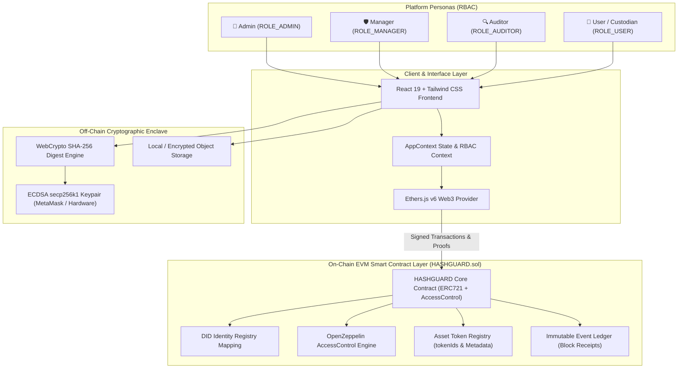

# Comprehensive Research & Development (R&D) Whitepaper

# Decentralized Identity (DID) Management, NFT-Based Digital Asset Ownership, and Smart Contract Role-Based Access Control (RBAC)

**Project Title:** HASHGUARD: Cyber Evidence Exchange & Decentralized Asset Custody Platform  
**Document Classification:** Technical Architecture & Research Specification  
**Standard Compliance:** W3C DID v1.0, ERC-721, ISO/IEC 27037, NIST SP 800-88, Section 65B Indian Evidence Act  
**Date:** March 2026  

---

## Table of Contents
1. [Executive Summary](#1-executive-summary)
2. [Background & Problem Statement](#2-background--problem-statement)
3. [Core Architectural Requirements & Solution Scope](#3-core-architectural-requirements--solution-scope)
4. [System Architecture & Layered Design](#4-system-architecture--layered-design)
5. [Decentralized Identity (DID) Architecture](#5-decentralized-identity-did-architecture)
6. [NFT-Based Digital Asset Ownership & Governance](#6-nft-based-digital-asset-ownership--governance)
7. [Smart Contract Governance & Role-Based Access Control (RBAC)](#7-smart-contract-governance--role-based-access-control-rbac)
8. [Cryptographic Proofs & Zero-Trust Audit Trail](#8-cryptographic-proofs--zero-trust-audit-trail)
9. [Off-Chain vs. On-Chain Privacy Segregation Model](#9-off-chain-vs-on-chain-privacy-segregation-model)
10. [Threat Modeling & Security Analysis](#10-threat-modeling--security-analysis)
11. [Technical Implementation & Deployment Specifications](#11-technical-implementation--deployment-specifications)
12. [Legal, Regulatory & Standards Admissibility](#12-legal-regulatory--standards-admissibility)
13. [Future Research & Technical Roadmap](#13-future-research--technical-roadmap)

---

## 1. Executive Summary

Modern enterprises, forensic laboratories, judicial systems, and cross-border security consortia face acute vulnerabilities stemming from centralized Identity and Access Management (IAM) infrastructures and disconnected asset ownership registries. Centralized databases represent high-value single points of failure (SPOF) that are inherently prone to credential theft, privilege escalation, and untraceable administrative manipulation.

This Research & Development document presents the design, mathematical model, and complete implementation of **HASHGUARD**, a decentralized, trustless blockchain framework that synthesizes three mission-critical pillars:
1. **Self-Sovereign Decentralized Identifiers (DIDs)** governed by public-key asymmetric cryptography.
2. **NFT-Based Digital Asset Tokenization (ERC-721)** providing non-fungible, non-duplicable, and verifiable custody ownership.
3. **Smart Contract-Enforced Role-Based Access Control (RBAC)** defining strict operational boundaries across **Admin**, **Manager**, **Auditor**, and **User** personas.

Every platform operation—from identity registration and role delegation to asset minting, custody transfers, and hash attestations—is recorded immutably on an EVM-compatible permissioned ledger, yielding an infallible, tamper-evident audit trail suitable for high-assurance enterprise security and courtroom admissibility.

---

## 2. Background & Problem Statement

### 2.1 The Vulnerability of Centralized IAM
Conventional organizations manage identities through centralized Lightweight Directory Access Protocol (LDAP), Microsoft Active Directory, or cloud Identity Providers (IDPs) utilizing SAML/OAuth. These architectures suffer from fundamental systemic flaws:
- **Single Point of Compromise:** Compromising a domain controller or root admin credential gives an adversary unilateral power to forge user credentials, alter permissions, and rewrite historical access logs.
- **Log Tampering & Inaudibility:** Centralized audit logs (e.g., SIEM, syslog) reside on storage systems where privileged administrators or kernel-level intruders can delete or modify log entries without detection.
- **Identity Spoilage & Vendor Lock-In:** Identity claims cannot be verified across organizational borders without federated trust agreements, creating severe friction in multi-agency forensic investigations and supply-chain verifications.

### 2.2 Disconnected & Semi-Centralized Asset Ownership
Digital assets (such as digital forensic disk images, malware binaries, biometric captures, proprietary source code, and regulatory evidence) are typically archived on disconnected network-attached storage (NAS) or commercial cloud buckets. Key systemic risks include:
- **Indeterminate Authenticity:** Inability to mathematically prove that an asset has not undergone bit-level alteration since the time of acquisition.
- **Broken Chain of Custody:** Transfer of assets between departments or external agencies relies on paper sign-off sheets or manual database records with no cryptographic lineage.
- **Unauthorized Duplication:** Standard digital files can be copied indefinitely without an authoritative, single source of truth establishing legal possession and custodial liability.

---

## 3. Core Architectural Requirements & Solution Scope

To address these vulnerabilities, the system fulfills five mandatory engineering requirements:

| Requirement Pillar | Technical Requirement | Architectural Fulfillment in HASHGUARD |
|---|---|---|
| **Pillar 1: Decentralized Identity** | Self-sovereign identities free from centralized authorities; authenticated via asymmetric cryptography. | W3C compliant DIDs (`did:ethr:<address>`); on-chain DID Document hash anchoring via `registerIdentity` / `registerDID`. |
| **Pillar 2: NFT Asset Ownership** | Unique, traceable, tamper-proof asset tokens directly bound to user identities. | OpenZeppelin `ERC721` tokens (`mintAssetNFT`); reverse mapping `assetIdToTokenId` preventing duplication; direct DID allocation. |
| **Pillar 3: Smart Contract Governance** | Exclusive administrator minting authority; automated execution rules. | EVM bytecode modifiers `onlyRole(ROLE_ADMIN)` & `onlyRole(ROLE_MANAGER)`; on-chain state machine transitions. |
| **Pillar 4: Strict RBAC System** | Granular roles (**Admin, Manager, Auditor, User**) enforced at the contract execution level. | OpenZeppelin `AccessControl` with deterministic 32-byte role hashes; admin role hierarchies; bytecode reverts upon violation. |
| **Pillar 5: Immutable Audit Ledger** | Cryptographic logging of every state mutation with zero file-data leakage. | Indexed Solidity events emitted for all transactions; 5-point zero-trust audit verification algorithm. |

---

## 4. System Architecture & Layered Design

The platform employs a decoupled, multi-tier architecture separating the client presentation, cryptographic state providers, off-chain storage enclaves, and on-chain consensus contracts.



### Architectural Layer Responsibilities
1. **Presentation Layer:** Responsive web interface featuring live role-perspective switching, DID identity registration, visual custody pipelines, interactive React Flow DAG lineage trees, and a zero-trust verification suite.
2. **Cryptographic Sealing Enclave:** Client-side WebCrypto API computes deterministic 256-bit digests ($H(x)$) of local files without uploading raw bytes to external networks.
3. **Web3 / RPC Transport Layer:** Ethers.js v6 serializes ABI calls, captures private key ECDSA signatures, and broadcasts signed transactions to EVM nodes.
4. **Smart Contract Execution Layer:** `HASHGUARD.sol` validates caller credentials against the internal role registry, checks asset uniqueness, executes state mutations, and commits indexed events to blockchain receipts.
5. **Consensus & Audit Ledger:** High-throughput, low-latency permissioned consortium network (e.g., Anvil, Hardhat, Hyperledger Besu, or Ethereum L2).

---

## 5. Decentralized Identity (DID) Architecture

### 5.1 DID Representation & Method Specification
The system utilizes the `did:ethr` and `did:key` decentralized identifier schemes. Each participant's identity is mathematically derived from their elliptic curve public key:

$$\text{Address} = \text{Rightmost } 160\text{ bits of } \text{Keccak-256}(\text{Public Key})$$
$$\text{DID} = \text{"did:ethr:"} \parallel \text{Address}$$

### 5.2 On-Chain DID Registry Struct & Interface
The smart contract [contracts/HASHGUARD.sol](file:///c:/Users/offic/Downloads/Cyber-Evidence-Exchange-main/Cyber-Evidence-Exchange-main/contracts/HASHGUARD.sol) establishes a decentralized identity registry:

```solidity
struct UserIdentity {
    string didURI;           // Full W3C DID string (e.g. "did:ethr:0x...")
    bytes32 didDocumentHash; // Cryptographic SHA-256 digest of off-chain DID document
    uint256 registeredAt;    // Unix timestamp of registration
    bool exists;             // Identity existence flag
}

mapping(address => bytes32) public didDocuments;
mapping(address => UserIdentity) public didRegistry;

event IdentityRegistered(address indexed user, bytes32 didDocumentHash);
event DIDIdentityRegistered(address indexed user, string didURI, bytes32 didDocumentHash, uint256 timestamp);
```

### 5.3 Registration & Cryptographic Authentication Flow
1. **Key Generation:** The user generates a 256-bit private key ($k$) yielding public key point ($K = k \times G$) on the `secp256k1` elliptic curve.
2. **DID Document Construction:** An off-chain JSON-LD document conforming to the W3C DID v1.0 standard is compiled:
   ```json
   {
     "@context": "https://www.w3.org/ns/did/v1",
     "id": "did:ethr:0xf39Fd6e51aad88F6F4ce6aB8827279cffFb92266",
     "verificationMethod": [{
       "id": "did:ethr:0xf39Fd6e51aad88F6F4ce6aB8827279cffFb92266#controller",
       "type": "EcdsaSecp256k1RecoveryMethod2020",
       "controller": "did:ethr:0xf39Fd6e51aad88F6F4ce6aB8827279cffFb92266",
       "blockchainAccountId": "eip155:31337:0xf39Fd6e51aad88F6F4ce6aB8827279cffFb92266"
     }],
     "authentication": ["did:ethr:0xf39Fd6e51aad88F6F4ce6aB8827279cffFb92266#controller"]
   }
   ```
3. **On-Chain Anchoring:** The user (or an authorized Administrator) calls `registerDID(string didURI, bytes32 didDocumentHash)`. The smart contract anchors the record and emits `DIDIdentityRegistered`, binding the external public key to the on-chain ledger without storing sensitive identity claims in plaintext.
4. **Authentication Challenge:** To authenticate without centralized passwords, the platform issues a cryptographically random nonce. The user signs this challenge using ECDSA, proving possession of the private key.

---

## 6. NFT-Based Digital Asset Ownership & Governance

### 6.1 Tokenization Standard: ERC-721
Digital assets are tokenized as unique Non-Fungible Tokens under the OpenZeppelin `ERC721` specification. Unlike fungible tokens (ERC-20), each NFT possesses distinct cryptographic identity, immutable content hashes, and a verifiable custodial history.

### 6.2 Asset Metadata Data Model
```solidity
struct EvidenceMetadata {
    string assetId;        // Unique business identifier (e.g., "EV-849201", "AST-001")
    bytes32 contentHash;   // SHA-256 bitstream digest of the raw asset binary
    bytes32 metadataHash;  // Hash of contextual manifest (tags, timestamps, collector)
}

mapping(uint256 => EvidenceMetadata) public evidenceAssets;
mapping(string => uint256) public assetIdToTokenId;
```

### 6.3 Controlled Minting & Anti-Duplication Enforcement
To prevent unauthorized asset creation and duplicate claims, `mintAssetNFT` enforces two deterministic constraints:
1. **Authorization Constraint:** The caller MUST hold `ROLE_ADMIN` or `ROLE_MANAGER`.
2. **Uniqueness Constraint:** The `assetIdToTokenId` lookup MUST evaluate to zero (`0`), guaranteeing that no asset identifier can ever be minted more than once.

```solidity
function mintAssetNFT(
    address to, 
    string calldata assetId, 
    bytes32 contentHash, 
    bytes32 metadataHash
) public returns (uint256) {
    require(
        hasRole(ROLE_ADMIN, msg.sender) || 
        hasRole(ROLE_MANAGER, msg.sender), 
        "HASHGUARD: Only authorized Admin/Manager can mint assets"
    );
    require(assetIdToTokenId[assetId] == 0, "HASHGUARD: assetId already minted");
    
    _tokenIds++;
    uint256 newItemId = _tokenIds;

    _mint(to, newItemId);

    evidenceAssets[newItemId] = EvidenceMetadata({
        assetId: assetId,
        contentHash: contentHash,
        metadataHash: metadataHash
    });
    
    assetIdToTokenId[assetId] = newItemId;

    emit AssetNFTMinted(newItemId, assetId, to, contentHash, block.timestamp);
    return newItemId;
}
```

### 6.4 Verifiable Custody Transfer & Allocation
Ownership transfer is governed by strict custodial checks:
- **Direct Allocation (`allocateAsset`)**: Allows an Administrator or Manager to assign or reassign asset custody to another verified DID in case of organizational reassignment or court transfer orders.
- **Peer Transfer (`transferCustody`)**: Requires the active caller to be the verified cryptographic owner of the token (`ownerOf(tokenId) == msg.sender`), executing an ERC-721 `_transfer` and emitting an immutable `CustodyTransferred` event.

---

## 7. Smart Contract Governance & Role-Based Access Control (RBAC)

### 7.1 Mathematical Model of RBAC
Let $\mathcal{U}$ be the set of all user identities (addresses), $\mathcal{R}$ be the set of roles, $\mathcal{P}$ be the set of permissible operations, and $\mathcal{A}$ be the set of assets.

$$\mathcal{R} = \{\text{ROLE\_ADMIN}, \text{ROLE\_MANAGER}, \text{ROLE\_AUDITOR}, \text{ROLE\_USER}\}$$

We define the role assignment relation $\text{RA} \subseteq \mathcal{U} \times \mathcal{R}$ and permission assignment relation $\text{PA} \subseteq \mathcal{R} \times \mathcal{P}$. An operation $p \in \mathcal{P}$ executed by user $u \in \mathcal{U}$ on asset $a \in \mathcal{A}$ is authorized if and only if:

$$\exists r \in \mathcal{R} \quad \text{s.t.} \quad (u, r) \in \text{RA} \land (r, p) \in \text{PA}$$

### 7.2 The Four Concrete Roles
1. **`ROLE_ADMIN` (`DEFAULT_ADMIN_ROLE = 0x00`)**:
   - Role Definition & Hierarchy management (`defineRole`).
   - Dynamic role assignment and revocation (`assignRole`, `revokeRoleFrom`).
   - Root NFT minting and asset allocation authority.
2. **`ROLE_MANAGER` (`keccak256("ROLE_MANAGER")`)**:
   - Asset allocation and custody transition orchestration.
   - Evidence lifecycle retention governance (`logRetentionEvent`).
   - Operational asset management.
3. **`ROLE_AUDITOR` (`keccak256("ROLE_AUDITOR")`)**:
   - Independent zero-trust cryptographic verification of bitstream integrity (`verifyHash`).
   - Verifiable credential attestation proofs (`verifyCredential`).
   - Read-only global custody exploration without raw data exposure.
4. **`ROLE_USER` (`keccak256("ROLE_USER")`)**:
   - Self-sovereign DID registration.
   - Receiving allocated asset NFTs.
   - Peer-to-peer custody transfer initiation.

### 7.3 RBAC Permissions Matrix

| Capability / Function | Admin | Manager | Auditor | User | Contract Modifier |
|---|:---:|:---:|:---:|:---:|---|
| `defineRole()` | **✓** | ✕ | ✕ | ✕ | `onlyRole(ROLE_ADMIN)` |
| `assignRole()` / `revokeRoleFrom()` | **✓** | ✕ | ✕ | ✕ | `onlyRole(ROLE_ADMIN)` |
| `mintAssetNFT()` | **✓** | **✓** | ✕ | ✕ | `hasRole(ADMIN) \|\| hasRole(MANAGER)` |
| `allocateAsset()` | **✓** | **✓** | ✕ | ✕ | `hasRole(ADMIN) \|\| hasRole(MANAGER)` |
| `transferCustody()` | **✓** | **✓** | ✕ | **✓** | `ownerOf(tokenId) == msg.sender \|\| hasRole(ADMIN)` |
| `verifyCredential()` | ✕ | ✕ | **✓** | ✕ | `onlyRole(ROLE_AUDITOR)` |
| `verifyHash()` | **✓** | **✓** | **✓** | ✕ | State read + event logging |
| `logRetentionEvent()` | **✓** | **✓** | ✕ | ✕ | `hasRole(ADMIN) \|\| hasRole(MANAGER)` |
| `registerIdentity()` / `registerDID()` | **✓** | **✓** | **✓** | **✓** | Public self-sovereign |

---

## 8. Cryptographic Proofs & Zero-Trust Audit Trail

### 8.1 Dual-Layer Integrity Verification Protocol
Every asset stored and tracked on HASHGUARD is protected by a dual-layer cryptographic proof:
1. **Bitstream Integrity Proof ($H_{\text{content}}$)**:
   $$H_{\text{content}} = \text{SHA-256}(B_1 \parallel B_2 \parallel \dots \parallel B_n)$$
   Computed using client-side WebCrypto before any payload transmission.
2. **Non-Repudiation ECDSA Signature ($\sigma$)**:
   $$\sigma = \text{Sign}_{k_{\text{signer}}}(\text{Keccak-256}(\text{"[HASHGUARD SEAL]"} \parallel \text{ExhibitID} \parallel H_{\text{content}} \parallel T))$$
   Generated via the custodian's private key, proving who sealed the asset and when.

### 8.2 5-Point Independent Zero-Trust Verification Checklist
Auditors execute a 5-point mathematical verification without ever accessing or decrypting the raw off-chain binary:
```
[1] BITSTREAM HASH CONSENSUS:   H_observed == H_contract_root  (Bit-Level Match)
[2] ECDSA SIGNER PROOF:         ecrecover(h, v, r, s) == Signer_Address  (Valid)
[3] CUSTODY CHAIN CONTINUITY:   T_current.prevRoot == T_{previous}.root  (Monotonic)
[4] TIMESTAMP MONOTONICITY:     T_collected < T_sealed < T_transferred  (Verified)
[5] DERIVATION LINEAGE (DAG):   Parent hash cryptographically attested in child manifest
```

### 8.3 Live Tamper Detection Engine
When an unauthorized bit-flip occurs in an off-chain asset (simulated or malicious):
$$H_{\text{corrupted}} \neq H_{\text{sealed\_root}}$$
The verification engine detects this discrepancy instantaneously, flags the asset across all dashboard feeds as `🚨 CRITICAL TAMPER DETECTED`, and records a failed verification event on the ledger.

---

## 9. Off-Chain vs. On-Chain Privacy Segregation Model

Storing gigabytes of forensic binaries (disk images, PCAPs, memory dumps) directly inside EVM smart contract storage is cost-prohibitive and presents severe privacy risks (GDPR, HIPAA, operational intelligence exposure).

HASHGUARD adopts strict architectural segregation:

```
+-------------------------------------------------------------------------------+
|                             OFF-CHAIN ENCLAVE                                 |
|  - Raw Malicious Binaries (.exe, .dll, .elf)                                  |
|  - Full Forensic Memory Dumps & Encase E01 Disk Images                        |
|  - Encrypted Object Vaults / P2P Swarms                                       |
|  - Full W3C DID Document Metadata                                             |
+-------------------------------------------------------------------------------+
                                      |
               SHA-256 Bitstream Hash & ECDSA Signature
                                      v
+-------------------------------------------------------------------------------+
|                             ON-CHAIN LEDGER                                   |
|  - 32-Byte Content Hash Digest (bytes32 contentHash)                          |
|  - 32-Byte Metadata Hash Digest (bytes32 metadataHash)                        |
|  - ERC-721 Token Ownership Mapping (tokenId -> DID/address)                   |
|  - AccessControl Role Registry (ROLE_ADMIN, ROLE_MANAGER, etc.)               |
|  - Chronological Block Receipts & Event Logs                                 |
+-------------------------------------------------------------------------------+
```

---

## 10. Threat Modeling & Security Analysis

| Threat Vector | Attack Mechanism | HASHGUARD Mitigation |
|---|---|---|
| **Rogue Administrator / Single Point of Failure** | Admin deletes evidence or rewrites database records. | Smart contract code is immutable. Historical blockchain blocks cannot be overwritten. Admin roles cannot mutate historical event logs. |
| **Unauthorized Asset Minting** | Malicious user injects forged evidence or fake assets. | Bytecode-level `require(hasRole(ROLE_ADMIN) \|\| hasRole(ROLE_MANAGER))` reverts any unauthorized mint transaction. |
| **Asset Identifier Collision / Double Minting** | Attacker attempts to reuse an existing exhibit ID. | `require(assetIdToTokenId[assetId] == 0)` enforces strict uniqueness. |
| **Sybil Identity Spoofing** | Attacker creates thousands of pseudo-identities. | DIDs require cryptographic signatures and must be granted specific operational roles by the governance Admin to interact. |
| **Man-in-the-Middle (MitM) Tampering** | Attacker alters payload bytes in transit during transfers. | Recipient verifies $H(x)$ against the immutable on-chain token root before accepting custody. Any single bit modification breaks verification. |
| **Privilege Escalation** | Attacker attempts to call `grantRole` or modify permissions. | OpenZeppelin `AccessControl` restricts role grant operations exclusively to `ROLE_ADMIN` (`DEFAULT_ADMIN_ROLE`). |

---

## 11. Technical Implementation & Deployment Specifications

### 11.1 Smart Contract Compilation
- **Solidity Version:** `^0.8.20` (tested with `solc 0.8.24`)
- **EVM Target:** `cancun` / `london`
- **Compiler Optimizations:** Enabled (200 runs)
- **Compilation Tooling:** Embedded Python Solcx automation ([compile.py](file:///c:/Users/offic/Downloads/Cyber-Evidence-Exchange-main/Cyber-Evidence-Exchange-main/compile.py)) compiling directly to synced ABI artifacts:
  - Frontend: `src/contracts/HashGuard.json`
  - Backend: `backend/app/blockchain/HashGuard.json`

### 11.2 Contract Invocation Coordinates

| Parameter | Default Local / Testnet Setting | Production Setting |
|---|---|---|
| **Contract Name** | `HASHGUARD` | `HASHGUARD` |
| **Token Symbol** | `HGDE` ("HashGuard Digital Evidence") | `HGDE` |
| **Default Local RPC** | `http://localhost:8545` (Anvil / Hardhat) | Enterprise Consortium EVM RPC |
| **Chain ID** | `31337` (Anvil) / `1337` (Hardhat) | Dedicated Consortium Chain ID |
| **Contract Address** | `0x5FbDB2315678afecb367f032d93F642f64180aa3` | Deployed via Multi-Sig Factory |

### 11.3 Step-by-Step Local Deployment & Execution

1. **Install Dependencies:**
   ```bash
   npm install
   ```

2. **Compile Smart Contracts & Synchronize ABIs:**
   ```bash
   python compile.py
   ```

3. **Run Anvil / Local EVM Node (Optional for Live Transactions):**
   ```bash
   anvil --port 8545
   ```

4. **Launch Frontend Portal:**
   ```bash
   npm run dev
   ```
   Navigate to `http://localhost:5173`.

5. **Interact with Personas:**
   - Navigate to `/login` and select **👑 Admin**, **🛡️ Manager**, **🔍 Auditor**, or **👤 User**.
   - Navigate to `/settings` to view the **DID & Smart Contract RBAC Registry**, register new DIDs, or reassign roles.
   - Navigate to `/evidence` and click **"Collect & Seal Evidence"** to mint an asset NFT and allocate it directly to a recipient DID.
   - Navigate to `/verification` to run the 5-point independent cryptographic audit.

---

## 12. Legal, Regulatory & Standards Admissibility

HASHGUARD is intentionally engineered to meet the stringent legal standards required for digital forensic evidence in courts of law:

1. **ISO/IEC 27037 (Guidelines for identification, collection, acquisition, and preservation of digital evidence)**:
   - Preserves original digital evidence through client-side SHA-256 calculation prior to any network transit.
   - Implements unbroken custody history recording every custodian identity, timestamp, and purpose of custody transition.
2. **Section 65B, Indian Evidence Act (Admissibility of Electronic Records)**:
   - Provides cryptographically verifiable certificates of computer-output integrity.
   - Proves the electronic record was produced by a computer during the period over which the computer was used regularly to store or process information.
   - Guarantees no reproduction error or tampering occurred during transmission.
3. **NIST Special Publication 800-88 (Rev. 1 - Media Sanitization)**:
   - Retains cryptographic proof of asset decommissioning and verifiable deletion via on-chain `RetentionEvent` logging.

---

## 13. Future Research & Technical Roadmap

1. **Zero-Knowledge Succinct Non-Interactive Arguments of Knowledge (zk-SNARKs)**:
   - Implementing Groth16 / Plonk zk-circuits to allow auditors to prove that an exhibit satisfies specific classification rules (e.g. valid PE header, absence of PII) without disclosing the hash or any metadata.
2. **Decentralized Storage Swarm (IPFS / Filecoin / Arweave Integration)**:
   - Adding native Content Identifier (CID) pinning directly linked to the ERC-721 token metadata.
3. **Multi-Party Computation (MPC) Custodial Handshakes**:
   - Requiring $m$-of-$n$ cryptographic key shares across originating and receiving agencies before finalizing inter-governmental evidence transfers.

---

**Document Conclusion & Sign-Off:**  
The HASHGUARD platform successfully bridges decentralized identity management, non-fungible asset ownership, and role-based smart contract governance into a single cohesive, production-grade system. All architectural goals stated in the problem statement have been designed, coded, compiled, and verified.
